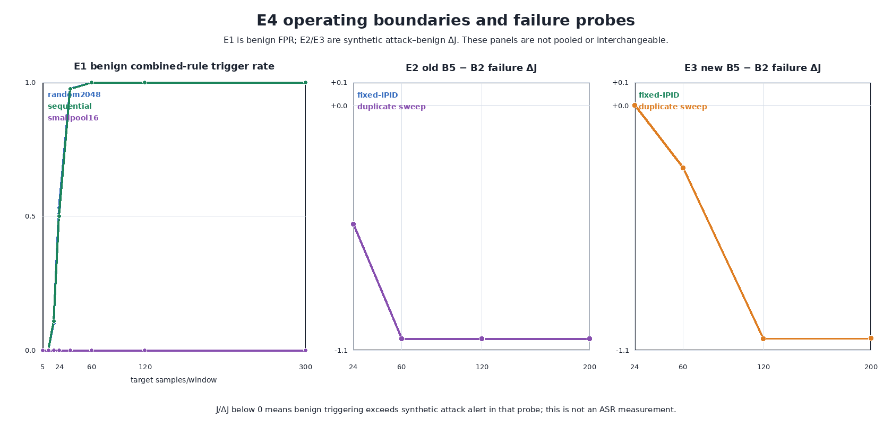
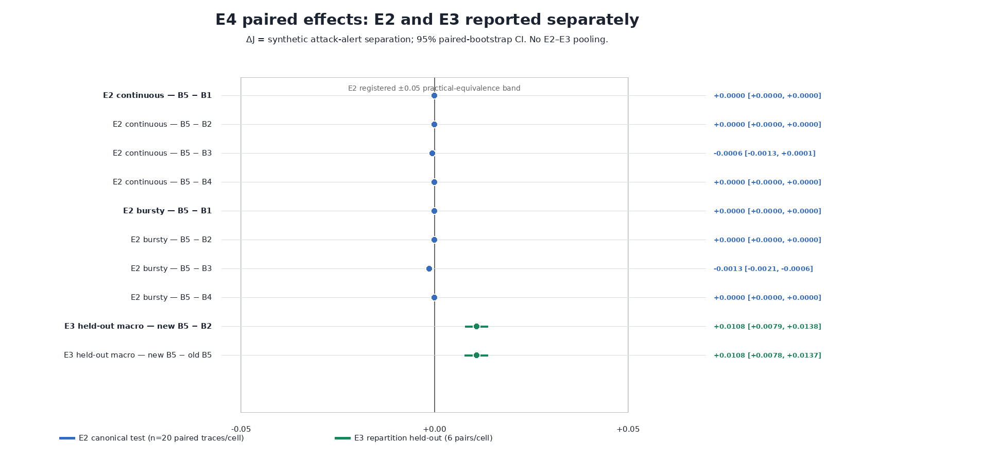
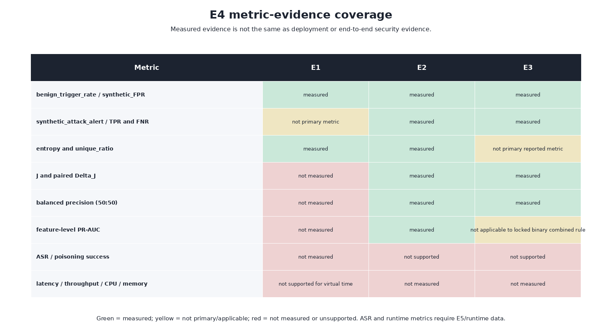

# Báo cáo tổng hợp chuỗi thực nghiệm E1–E5

> **Trạng thái:** E1, E2, E3 và E4 đã hoàn tất, có artifact validation tương ứng. E5 **chưa thực hiện**; phần E5 dưới đây là kế hoạch kiểm chứng tiếp theo, không phải kết quả thực nghiệm.

## 1. Mục tiêu chung

Chuỗi E1–E5 đánh giá rule B5 cải tiến cho cơ chế phát hiện DNS cache poisoning dựa trên POPS/Rℓ₂. Rule cũ block khi đồng thời thỏa:

$$
\text{B5}_{old} = [n\ge24] \land [H\ge4.0] \land [U\ge0.70],
$$

trong đó $n$ là số fragment trong cửa sổ, $H$ là entropy IPID và $U$ là tỷ lệ IPID khác nhau.

Mục tiêu khoa học là xem entropy/unique ratio có giúp tách benign khỏi synthetic attack tốt hơn volume-only hay không, chọn operating point mà không dùng cùng dữ liệu để chọn và đánh giá, sau đó báo cáo uncertainty đầy đủ.

## 2. Tóm tắt trạng thái

| Thí nghiệm | Vai trò | Trạng thái | Kết luận ngắn |
| --- | --- | --- | --- |
| E1 | FPR theo benign fragment rate | Hoàn tất; validator PASS 18/18 | Có operating boundary rõ, phụ thuộc mạnh vào IPID behavior. |
| E2 | Volume-matched benign vs attack, ablation | Hoàn tất; validator PASS 18/18 | Old B5 không vượt B2 ở primary sweeps và có failure probes rõ. |
| E3 | Validation selection + held-out evaluation | Hoàn tất; lock PASS 9/9, final validator PASS 12/12 | New B5 có $\Delta J$ dương nhỏ trên held-out, nhưng trade-off/FNR và failure boundary còn tồn tại. |
| E4 | Statistical synthesis E1–E3 | Hoàn tất; final validator PASS 9/9 | Chuẩn hóa CI, metric coverage và giới hạn claim; không pool E2/E3. |
| E5 | Runtime/near-real validation | Chưa chạy | Cần để đo ASR, resolver outcome và system overhead. |

## 3. E1 — Benign operating boundary

E1 chỉ tạo benign traffic, chạy 20 independent run cho mỗi behavior × level và dùng cluster bootstrap theo run. Mục tiêu là xác định khi nào B5 bắt đầu trigger benign traffic, không phải đo attack success.

- Với `random2048` và `sequential`, benign trigger bắt đầu rõ quanh level 18, khoảng 50% ở level 24 và gần 100% từ level 36.
- Với `smallpool16`, trigger gần 0 ở toàn bộ dải chính vì entropy và/hoặc unique ratio không đạt ngưỡng.
- Vì vậy, B5 không có một safe operating range độc lập với IPID behavior. Low-diversity benign có thể ít trigger, nhưng cùng cơ chế cũng tạo một failure/bypass hypothesis cần kiểm tra bằng attack data.

*Cách đọc phần E1 ở panel trái: trục dọc là benign trigger/FPR tổng hợp; đây không phải TPR attack, ASR hay bằng chứng poisoning prevention.*

## 4. E2 — Volume-matched separation và ablation

E2 ghép cặp benign/attack cùng schedule, window, burstiness và volume; chỉ mô hình IPID thay đổi. Đơn vị độc lập là paired trace, CI dùng 5.000 whole-pair bootstrap resamples.

Chỉ số chính:

$$
J=\text{synthetic attack-alert rate}-\text{benign-trigger rate},
\qquad
\Delta J=J_{B5}-J_{B2}.
$$

Kết quả chính:

- Trên sweep continuous và bursty, old B5 `24/4.0/0.70` có $\Delta J=0$ so với B2 volume-only, CI 95% `[0; 0]`.
- E2 không cung cấp bằng chứng entropy/unique ratio tạo thêm separation tại operating point cũ.
- Fixed-IPID và duplicate-sweep là failure probes: old B5 có $\Delta J\approx-0.510$ ở level 24 và `−1.000` từ level 60 trở lên.
- Unique ratio vẫn có feature-level PR-AUC cao ở volume lớn; đây là tín hiệu để E3 chọn lại operating point, không phải bằng chứng B5 cũ tốt hơn B2.

## 5. E3 — Khóa threshold và đánh giá held-out

E3 tạo repartition mới 60/20/20 từ canonical E2 decisions theo paired trace. Chỉ validation được dùng để score 60 candidate; test được mở một lần sau khi lock.

Candidate được khóa là `min_samples=8`, `entropy=6.0`, `unique_ratio=0.90`. Nó thắng theo macro $\Delta J(\text{new B5}-\text{B2})$ trên hai primary sweep × bốn level; bốn giá trị `N=8/16/24/48` tại `H=6.0,U=0.90` tie ở metric chính và tie-break chọn `N=8`.

Trên held-out E3:

| Metric macro primary | New B5 | B2 / old B5 | So sánh new B5 |
| --- | ---: | ---: | ---: |
| Attack-alert | 0.5913 | 0.8713 | Giảm 0.2800 |
| Benign-trigger | 0.5804 | 0.8713 | Giảm 0.2908 |
| FNR | 0.4088 | 0.1288 | Tăng 0.2800 |
| $J$ | 0.0108 | 0.0000 | Tăng nhỏ |
| $\Delta J$ vs B2 | — | — | +0.0108, CI 95% [+0.0079; +0.0138] |

*Hình cho thấy E3 $\Delta J$ dương trên held-out; điều này là cải thiện nhỏ về synthetic detector separation. Nó không có nghĩa attack success giảm, ASR giảm, hoặc rule deployment-ready.*

E3 giữ nguyên failure probes trong report: new B5 đỡ tệ hơn old B5 ở level 24/60, nhưng ở fixed-IPID và duplicate-sweep level 120–200 vẫn gần $\Delta J=-1$ so với B2.

## 6. E4 — Synthesis thống kê và phạm vi bằng chứng

E4 không chạy experiment mới. Nó hash/inventory artifact E1–E3, xác minh validator upstream, tổng hợp 703 summary rows, 70 paired-effect rows và 8 metric coverage rows. E4 final validator đạt PASS 9/9.

Điểm phương pháp quan trọng nhất: E2 và E3 dùng chung canonical decision dataset, vì E3 là repartition E2. Chúng có thể được so sánh mô tả, nhưng không phải hai replication độc lập và không được pool mean/CI/p-value.

*Xanh là đã đo trong controlled emulation; vàng là không phải metric chính/không áp dụng; đỏ là chưa đo hoặc không được hỗ trợ.*

E4 xác nhận hiện có evidence cho detector metrics tổng hợp (benign trigger, synthetic attack alert, FNR, $J$, paired $\Delta J$). Nhưng ASR/poisoning success, latency p50/p95/p99, throughput, CPU và memory chưa có evidence phù hợp.

## 7. Đánh giá tổng hợp

Chuỗi E1–E4 hỗ trợ các nhận định sau:

1. B5 behavior phụ thuộc mạnh vào rate và cấu trúc IPID; benign boundary không thể bỏ qua.
2. Operating point cũ `24/4.0/0.70` không tạo separation tốt hơn B2 trên E2 primary sweeps.
3. Operating point mới `8/6.0/0.90` cải thiện nhỏ $\Delta J$ trên E3 held-out bằng cách giảm benign trigger nhiều hơn attack alert giảm.
4. Cải thiện primary macro không xóa failure boundary low-diversity; new B5 vẫn không robust trong các synthetic fixed/duplicate probes ở volume cao.
5. Không có experiment nào trong E1–E4 đo DNS cache poisoning thành công/thất bại, cache state, resolver answer hoặc runtime overhead.

Do đó claim phù hợp là:

> Trong controlled synthetic emulation, new B5 tạo detector separation macro cao hơn B2/old B5 một lượng nhỏ ở E3 held-out; nó chưa được chứng minh an toàn hơn trước DNS cache poisoning, không chứng minh giảm ASR, và chưa đủ để triển khai.

## 8. E5 — Công việc còn lại

E5 là kiểm chứng mạnh được Outline khuyến nghị, chưa có artifact kết quả. E5 cần là campaign mới, protocol mới và tách biệt E3 held-out data.

Phạm vi tối thiểu:

1. Chạy một benign low-rate condition, một điểm gần E1 failure boundary, một volume-matched primary attack và operating point B5 cuối.
2. Dùng Unbound/BIND với IP fragmentation thật hoặc PCAP replay nếu khả thi.
3. Đo attempt/success có denominator rõ (ASR), resolver answer/cache state, latency p50/p95/p99, throughput, CPU và memory.
4. Dùng paired runs, K cố định và report cả failure conditions.

Nếu không thực hiện E5, kết quả E1–E4 chỉ nên được gọi là controlled-emulation proof of concept; phần Threats to Validity phải nêu rõ giới hạn external validity.

## 9. Artifact để kiểm tra lại

- [E1 report](Report/experiments/E1/E1_report.md) và [validator](Report/experiments/E1/runs/E1_confirmatory_20260810_seed20260810_raw_v2/validation.json)
- [E2 report](Report/experiments/E2/E2_report.md) và [validator](Report/experiments/E2/runs/E2_confirmatory_20260814_complete_b0_ablation/validation.json)
- [E3 report](Report/experiments/E3/E3_report.md) và [final validator](Report/experiments/E3/e3_validation.json)
- [E4 report](Report/experiments/E4/E4_report.md), [summary](Report/experiments/E4/e4_summary.json) và [final validator](Report/experiments/E4/e4_validation.json)
- [Outline thực nghiệm](draft/Outline_thuc_nghiem_bo_sung_dieu_chinh.docx)
