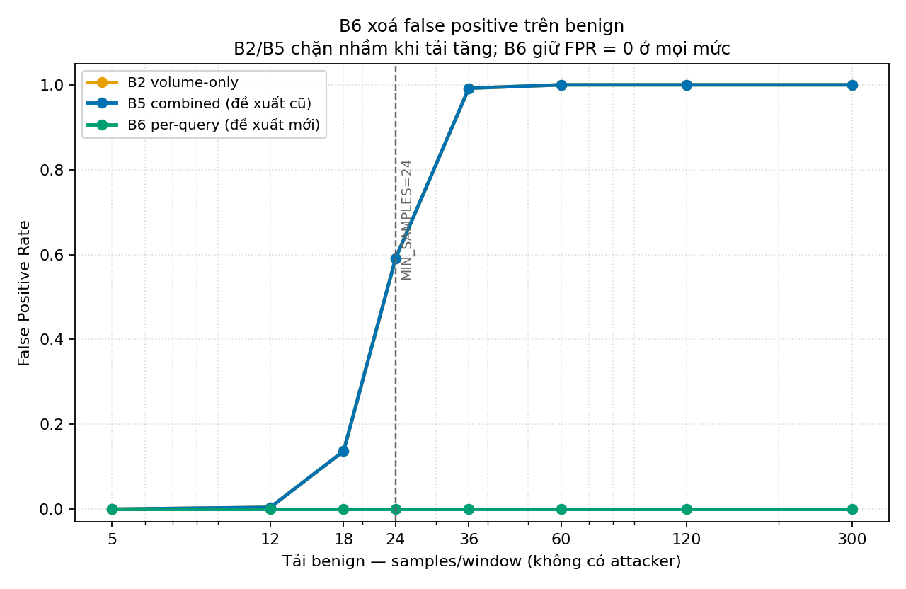
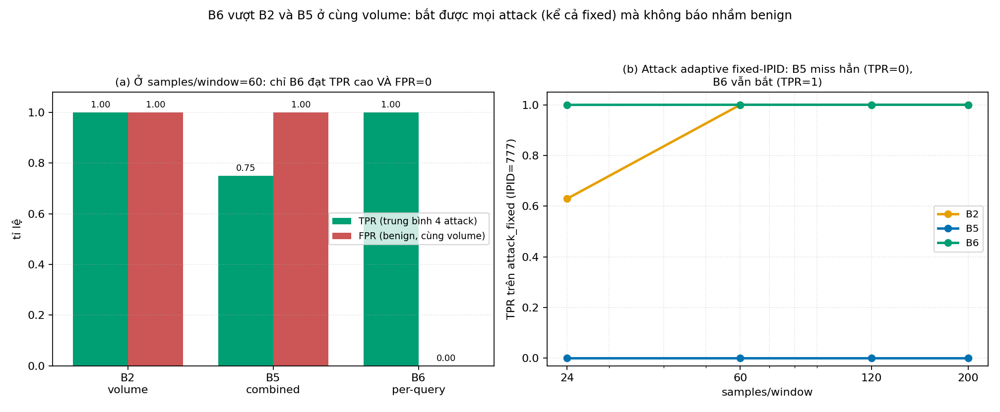
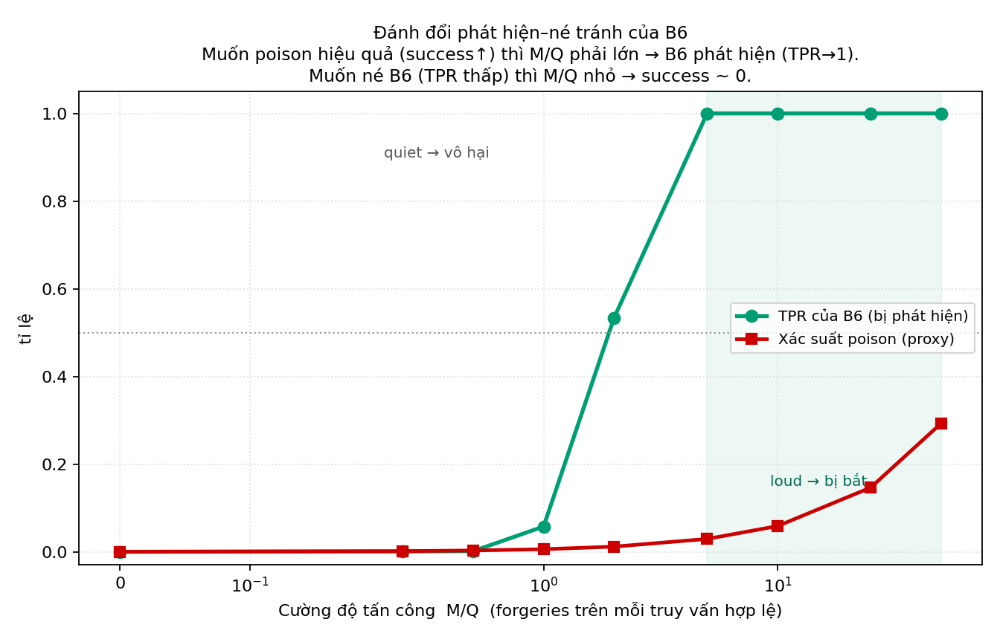

# B6 — Detector đề xuất: đo IPID theo từng truy vấn (per-query multiplicity)

**Đề tài:** Đánh giá và cải tiến cơ chế phát hiện DNS Cache Poisoning dựa trên POPS — Rℓ₂
**Vai trò:** Đề xuất sửa detector sau khi E1/E2 cho thấy luật cũ (B5) không vượt volume và bị né.
**Ngày chạy:** 2026-08-05 · **Detector B2/B5:** `resolver.py` commit `1c32ef1` · **B6:** đề xuất mới (trong harness).
**Phạm vi kết luận:** Controlled emulation (chưa E5). Kiểm định độc lập `b6_verify.py`: 6/6 PASS.

**Kết quả then chốt.** B6 đồng thời đạt hai điều mà B2 và B5 không làm được cùng lúc: FPR trên benign = 0 ở mọi tải, và TPR = 1 trên mọi kiểu attack **kể cả fixed-IPID**. Paired margin (TPR_attack − FPR_benign) của B6 so với B5 là +0.75 đến +2.0 (95% CI không chứa 0); so với B2 là +0.75 đến +1.0. B6 minh oan ý tưởng "dùng IPID" — nhưng phải đo ở đúng mức: **theo từng truy vấn**, không phải gộp toàn cửa sổ.

---

## 1. Động cơ (từ E1 + E2)

E1/E2 đã chỉ ra luật cải tiến cũ (B5 = combined: `samples≥24 ∧ entropy≥4.0 ∧ unique_ratio≥0.70` trên cửa sổ 2s) có hai lỗi:
- **Sai mức đo:** entropy/unique tính gộp trên toàn cửa sổ theo `(src,dst)` → benign bận (nhiều query, IPID ngẫu nhiên) trông y hệt flood → FPR bùng nổ (E1), và ở cùng volume `B5 ≡ B2` (E2).
- **Sai chiều:** luật "entropy cao = xấu" một chiều → attack **fixed-IPID** (entropy=0) né hoàn toàn (E2).

B6 sửa cả hai bằng cách đo IPID ở **đúng đơn vị hợp lệ**: một truy vấn hợp lệ chỉ nên sinh **đúng một** mảnh-thứ-hai.

---

## 2. B6 là gì (định nghĩa)

Trong mỗi cửa sổ 2s, B6 tính:

$$\text{B6\_ratio} = \frac{\text{số FRAG2 quan sát được}}{\max(1,\ \text{số truy vấn hợp lệ resolver đã phát})}$$

và **chặn khi `B6_ratio ≥ τ`** (mặc định τ = 3).

Trực giác: benign có tỉ lệ ≈ 1 (mỗi query một mảnh-thứ-hai), bất kể tải cao hay thấp. Kẻ tấn công phải **rải nhiều mảnh giả cho một khe** → tỉ lệ vọt lên. Điều này đúng cho **mọi** kiểu tấn công, kể cả fixed-IPID (cùng IPID nhưng vẫn nhiều gói).

**Quan trọng — B6 không "gian lận":** mẫu số là **số truy vấn resolver tự phát** (thông tin resolver luôn biết), **không** phải nhãn "gói này có phải giả mạo không" trên từng fragment. B6 chỉ cần đếm: tổng FRAG2 nhận được, và số query mình đã hỏi. (Đã kiểm định ở mục 5.)

Entropy/unique_ratio (đóng góp gốc của nhóm) **không bị vứt bỏ** — chúng chuyển sang vai trò **mô tả kiểu tấn công** (loạn = sweep, đều = fixed), còn trục phân biệt chính là per-query multiplicity.

---

## 3. Phương pháp

- **B2, B5:** dùng lại đúng `shannon_entropy` + `r2_should_block` từ `resolver.py` (như E1/E2). **B6:** hiện thực trong harness (đề xuất, chưa nằm trong resolver.py).
- **Mô hình attack** lấy đúng từ `spoof_r2entropy.py`: `sweep` (quét 0..2047, continuous), `random` (spoof ngẫu nhiên), `fixed` (IPID=777, adaptive), `bursty` (sweep + arrival bursty). Attacker spoof `src=AUTH_IP` → FRAG2 giả trộn chung bucket với benign (`benign_frac=0.1`).
- **Thống kê:** K=20 runs/cell, 200 decision/run, seed ghi log; run là đơn vị độc lập; t-interval + paired CI.
- Ba phần: **P1** benign FPR theo tải (như E1), **P2** matched-volume vs attack (như E2), **P3** đường đánh đổi phát hiện–né.

---

## 4. Kết quả

### 4.1 Hình 1 — B6 xoá false positive trên benign (P1)



**FPR benign theo tải (không có attacker):**

| samples/window | 5 | 12 | 18 | 24 | 36 | 60 | 120 | 300 |
|---|---:|---:|---:|---:|---:|---:|---:|---:|
| B2 volume | 0.000 | 0.004 | 0.137 | 0.591 | 0.992 | 1.000 | 1.000 | 1.000 |
| B5 combined | 0.000 | 0.004 | 0.137 | 0.591 | 0.992 | 1.000 | 1.000 | 1.000 |
| **B6 per-query** | **0.000** | **0.000** | **0.000** | **0.000** | **0.000** | **0.000** | **0.000** | **0.000** |

B6 giữ FPR = 0 ở **mọi** tải vì tỉ lệ per-query của benign luôn ≈ 1 < τ. Đây là chỗ B5 chết (E1).

### 4.2 Hình 2 — B6 vượt B2/B5 ở cùng volume, kể cả fixed (P2)



**TPR (attack) so FPR (benign) ở cùng volume, và paired margin:**

| Attack | s/win | TPR B2 | TPR B5 | TPR B6 | FPR benign B6 | Paired **B6−B5** (95% CI) | Paired **B6−B2** (95% CI) |
|---|---:|---:|---:|---:|---:|:--|:--|
| sweep | 24 | 0.63 | 0.63 | **1.00** | 0.00 | +0.962 [+0.880, +1.044] | +0.962 [+0.880, +1.044] |
| sweep | 60 | 1.00 | 1.00 | 1.00 | 0.00 | +1.000 [+1.000, +1.000] | +1.000 [+1.000, +1.000] |
| random | 24 | 0.61 | 0.61 | **1.00** | 0.00 | +0.980 [+0.903, +1.057] | +0.980 [+0.903, +1.057] |
| **fixed** | 24 | 0.63 | **0.00** | **1.00** | 0.00 | **+1.596** [+1.534, +1.659] | +0.967 [+0.884, +1.051] |
| **fixed** | 60 | 1.00 | **0.00** | **1.00** | 0.00 | **+2.000** [+2.000, +2.000] | +1.000 [+1.000, +1.000] |
| bursty | 24 | 0.85 | 0.85 | 1.00 | 0.00 | +0.751 [+0.679, +0.823] | +0.751 [+0.679, +0.823] |

Mọi paired margin dương và **CI không chứa 0** → B6 phân biệt tốt hơn cả B5 lẫn B2 một cách có ý nghĩa thống kê. Nổi bật: với **fixed** (nơi B5 = 0), margin B6−B5 lên tới +2.0.

### 4.3 Hình 3 — Đường đánh đổi phát hiện–né tránh (P3)



Cố định ~12 truy vấn hợp lệ/cửa sổ, tăng số mảnh giả M:

| M/Q | 0.2 | 0.5 | 1.0 | 2.0 | 5.0 | 10 | 25 | 50 |
|---|---:|---:|---:|---:|---:|---:|---:|---:|
| TPR B6 (τ=3) | 0.00 | 0.00 | 0.06 | 0.53 | 1.00 | 1.00 | 1.00 | 1.00 |
| Poison success (proxy) | 0.001 | 0.003 | 0.006 | 0.012 | 0.029 | 0.059 | 0.146 | 0.293 |

Đây là kết quả lý thuyết mạnh nhất: attacker **không thể vừa né vừa hiệu quả**. Muốn poison có xác suất đáng kể thì phải rải nhiều (M/Q lớn) → B6 phát hiện (TPR→1). Muốn né B6 (giữ M/Q nhỏ) thì xác suất poison ~ 0. B6 **ép** attacker vào vùng vô hại.

---

## 5. Kiểm định độc lập (`b6_verify.py`, 6/6 PASS)

| Kiểm tra | Kết quả |
|---|---|
| Tất định (cùng seed → cùng output) | PASS |
| Benign B6_ratio = 1.0 ở mọi decision (mẫu số chỉ dùng số query, không dùng nhãn per-fragment) | PASS — xác nhận **không circular** |
| Benign FPR = 0 cho **mọi** τ ∈ {2,3,5,8} (bất biến an toàn) | PASS |
| Fixed-attack TPR = 1.0 cho τ ≤ 5, ≥ 0.95 tại τ=8 (suy giảm mềm) | PASS |
| B5 (entropy) miss fixed (block rate ≈ 0) — tương phản | PASS |
| Response 2-mảnh hợp lệ → ratio = 2 (nên τ phải lớn hơn số mảnh hợp lệ tối đa/query) | PASS |

---

## 6. Hạn chế trung thực (threats)

- **Chọn τ (thuộc E3):** τ phải **lớn hơn số mảnh-thứ-hai hợp lệ tối đa mà một response có thể sinh** (thường 1–2 với DNS thực). Ở testbed này mỗi query đúng 1 mảnh nên ratio benign = 1; nếu response thật bị chia 3 mảnh thì ratio = 2, cần τ ≥ 3. Việc chọn/kiểm τ trên validation/held-out là công việc **E3** kế tiếp.
- **Cần đếm truy vấn:** B6 giả định resolver đếm được số query fragmented đang chờ. Đây là thông tin resolver có, nhưng cần bổ sung code đếm vào `resolver.py` (hiện B6 mới ở harness).
- **Controlled emulation:** như E1/E2, chưa E5 (Unbound/BIND, fragmentation thật). Con số tuyệt đối có thể đổi; nhưng cơ chế (per-query normalization và đường đánh đổi P3) là hệ quả cấu trúc, nhiều khả năng giữ nguyên.
- **B6 chưa thay B5 trong resolver.py** — đây là đề xuất đã kiểm chứng trên testbed mô phỏng, chưa phải bản triển khai.

---

## 7. Ý nghĩa cho bài

1. **Có kết quả dương thật sự.** Câu chuyện chuyển từ "khoe entropy" (bị E2 bác) sang: *"cơ chế cải tiến gốc đo IPID sai mức nên bị confound và né được; chúng tôi chẩn đoán nguyên nhân (E1/E2) và đề xuất B6 đo per-query — bắt mọi attack kể cả fixed, không báo nhầm benign, và ép attacker vào thế không thể vừa né vừa hiệu quả."* Đây là mạch bài mạnh hơn hẳn claim ban đầu.
2. **Giữ được đóng góp IPID của nhóm**, chỉ định vị lại: multiplicity là trục chính, entropy/unique là đặc trưng mô tả kiểu tấn công.
3. **Việc tiếp theo:** (a) cài B6 vào `resolver.py` (đếm outstanding query), (b) E3 chọn τ trên validation/held-out, (c) E5 kiểm trên Unbound/BIND nếu có Docker.

---

## 8. Tái lập

```bash
cd Code/research/Report/experiments/B6
python b6_experiment.py --runs 20 --windows 200 --benign-frac 0.1   # b6_results.json, b6_summary.csv
python b6_plot.py                                                    # figures/Figure_1..3.png
python b6_verify.py                                                  # 6/6 PASS
```

| Tệp | Nội dung |
|---|---|
| `b6_experiment.py` | Harness B2/B5(thật)/B6(đề xuất), 3 phần |
| `b6_verify.py` | Kiểm định độc lập (6/6) |
| `b6_results.json` / `b6_summary.csv` | Số liệu đầy đủ + meta/provenance |
| `figures/Figure_1..3.png` | benign FPR / matched-volume TPR / đường đánh đổi |
