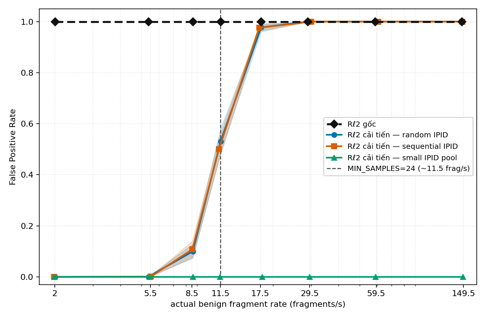
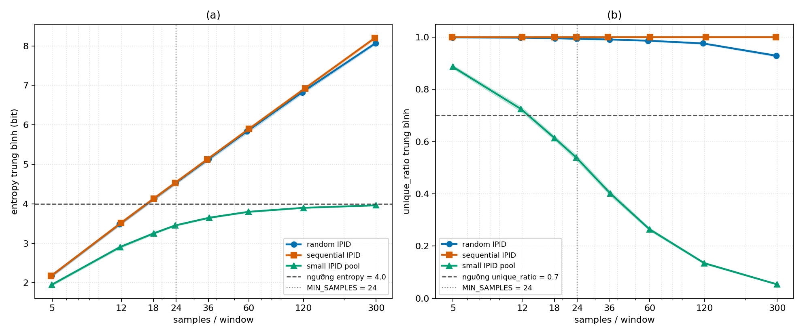

# E1 — Khi nào luật mới bắt đầu bật bảo vệ nhầm?

> **Bản dùng để chép vào báo cáo.** Nội dung được viết lại từ bộ dữ liệu E1 đã kiểm tra, mã lần chạy `E1-confirmatory-20260810-s20260810-raw-v2`. Phần thử nghiệm chính có 480 lần chạy và 144.000 quyết định. Phần tải rất cao có thêm 160 lần chạy và 48.000 quyết định. Toàn bộ 18 bước kiểm tra dữ liệu đều đạt.

## 1. Mục tiêu

Luật Rℓ₂ gốc của POPS bật bước bảo vệ mỗi khi gặp phản hồi DNS bị chia thành nhiều mảnh. Cách này ưu tiên an toàn, nhưng cũng có thể làm hệ thống bật xử lý bảo vệ khi lưu lượng thực ra hợp lệ.

E1 kiểm tra xem luật mới B5 có giảm được những lần bật bảo vệ không cần thiết hay không, và khi tải fragment tăng thì B5 bắt đầu bật nhầm từ mức nào.

Trong E1, tất cả lưu lượng đều là lưu lượng hợp lệ được tạo bằng mô phỏng. Vì vậy:

- nếu luật bật bảo vệ, quyết định đó được tính là một lần bật nhầm;
- FPR là tỷ lệ số lần bật bảo vệ nhầm trên tổng số quyết định;
- “bật bảo vệ nhầm” không có nghĩa máy chủ DNS đã trả về câu trả lời sai. Nó chỉ có nghĩa bước xử lý an toàn được kích hoạt dù không có tấn công.

## 2. Luật B5 hoạt động như thế nào?

B5 chỉ bật bảo vệ khi cả ba điều kiện sau cùng đúng:

| Điều kiện | Cách hiểu đơn giản |
| --- | --- |
| `samples ≥ 24` | Có ít nhất 24 fragment trong cửa sổ 2 giây. |
| `entropy ≥ 4.0` | Các giá trị IPID phân tán đủ rộng. |
| `unique_ratio ≥ 0.70` | Số IPID khác nhau bằng ít nhất 70% số fragment trong cửa sổ. |

Đây là **một luật có ba điều kiện**, không phải ba luật entropy. Chỉ điều kiện thứ hai sử dụng entropy.

## 3. Cách chạy thí nghiệm

E1 thử ba cách tạo IPID:

1. **IPID ngẫu nhiên (`random2048`):** IPID được chọn ngẫu nhiên trong 2.048 giá trị.
2. **IPID tuần tự (`sequential`):** IPID tăng lần lượt 1, 2, 3, ...
3. **Nhóm 16 IPID (`smallpool16`):** IPID chỉ nằm trong 16 giá trị nên bị lặp nhiều.

Mỗi kiểu IPID được thử ở tám mức mục tiêu: 5, 12, 18, 24, 36, 60, 120 và 300 fragment trong một cửa sổ 2 giây. Mỗi trường hợp được chạy độc lập 20 lần, mỗi lần có 300 quyết định.

Như vậy, mỗi **kiểu IPID tại mỗi mức tải** có 6.000 quyết định. Toàn bộ phần thử nghiệm chính có 24 trường hợp, 480 lần chạy và 144.000 quyết định.

Số fragment thực tế có thể lệch nhẹ so với mức mục tiêu. Vì vậy kết quả có báo thêm tốc độ fragment thực đo.

## 4. Kết quả chính

| Mức tải mục tiêu | Tốc độ thực đo gần đúng | IPID ngẫu nhiên | IPID tuần tự | Nhóm 16 IPID |
| ---: | ---: | ---: | ---: | ---: |
| 5 | khoảng 2 fragment/s | không ghi nhận | không ghi nhận | không ghi nhận |
| 12 | khoảng 5,4–5,5 fragment/s | 0,07% | 0,12% | không ghi nhận |
| 18 | khoảng 8,5–8,6 fragment/s | 10,0% | 10,8% | không ghi nhận |
| 24 | khoảng 11,3–11,5 fragment/s | 53,2% | 50,1% | không ghi nhận |
| 36 | khoảng 17,3–17,9 fragment/s | 97,7% | 97,6% | không ghi nhận |
| 60–300 | khoảng 29–149 fragment/s | 100% | 100% | không ghi nhận |

### 4.1. Với IPID ngẫu nhiên và tuần tự

Hai kiểu IPID này cho kết quả gần giống nhau:

- Ở mức 5, thử nghiệm không ghi nhận lần bật nhầm nào.
- Ở mức 12, B5 bắt đầu bật nhầm nhưng tỷ lệ còn rất thấp, chỉ khoảng 0,07–0,12%.
- Ở mức 18, khoảng một trong mười quyết định bị bật nhầm.
- Ở mức 24, khoảng một nửa số quyết định bị bật nhầm.
- Ở mức 36, gần như mọi quyết định đều bị bật nhầm.
- Từ mức 60 đến 300, tất cả quyết định trong dữ liệu đã chạy đều bật bảo vệ.

Khoảng tin cậy 95% được tính bằng cluster bootstrap trên 20 lần chạy độc lập tại các điểm quan trọng cũng cho cùng kết luận:

| Trường hợp | FPR đo được | Khoảng tin cậy 95% theo lần chạy |
| --- | ---: | ---: |
| IPID ngẫu nhiên, mức 18 | 10,0% | 7,4–12,8% |
| IPID tuần tự, mức 18 | 10,8% | 7,6–14,0% |
| IPID ngẫu nhiên, mức 24 | 53,2% | 48,8–58,1% |
| IPID tuần tự, mức 24 | 50,1% | 45,7–54,1% |
| IPID ngẫu nhiên, mức 36 | 97,7% | 96,0–99,1% |
| IPID tuần tự, mức 36 | 97,6% | 96,4–98,7% |

Điểm chuyển trạng thái của B5 nằm quanh mức 18–24 fragment trong cửa sổ 2 giây. Ở mức 18, tỷ lệ bật nhầm đã tăng rõ ràng. Đến mức 24, tỷ lệ này đạt khoảng 50%.

### 4.2. Với nhóm 16 IPID

Trong `smallpool16`, thử nghiệm không ghi nhận lần bật nhầm nào ở cả tám mức tải. Nguyên nhân là các IPID bị lặp nhiều:

- entropy trung bình tăng từ 1,953 ở mức 5 lên 3,963 ở mức 300 và vẫn dưới ngưỡng 4,0;
- tỷ lệ IPID khác nhau giảm từ 0,887 xuống 0,054 khi tải tăng;
- tại mức 12, `unique_ratio` trung bình là 0,725; đến mức 18, giá trị này giảm còn 0,613, tức đã xuống dưới ngưỡng 0,70.

Vì một trong ba điều kiện không đạt, B5 không bật bảo vệ.

Kết quả này chưa chắc là tin tốt. Nó cho thấy B5 ít làm phiền lưu lượng hợp lệ có IPID lặp nhiều, nhưng một kẻ tấn công cũng có thể cố tạo IPID lặp để né luật. E1 không có kẻ tấn công nên chưa thể kết luận B5 vẫn an toàn trong trường hợp đó.

“Không ghi nhận” cũng không có nghĩa tỷ lệ thật chắc chắn bằng 0. Mỗi trường hợp chỉ có 20 lần chạy. Với 0/20 lần chạy xuất hiện bật nhầm, cận trên 95% cho khả năng một lần chạy có ít nhất một lần bật nhầm vẫn là 16,8%.

## 5. Entropy và tỷ lệ IPID khác nhau giải thích kết quả ra sao?

Với IPID ngẫu nhiên và IPID tuần tự, entropy trung bình vượt ngưỡng 4,0 từ khoảng mức 18. Tỷ lệ IPID khác nhau trung bình cũng luôn gần 1,0. Vì vậy, khi số fragment đạt khoảng 24, cả ba điều kiện của B5 thường cùng đạt và tỷ lệ bật bảo vệ tăng nhanh.

Trong hai kiểu IPID đa dạng này, B5 cho đúng cùng số quyết định chặn như B2 — phiên bản chỉ kiểm tra có đủ 24 fragment hay không. Nói cách khác, entropy và `unique_ratio` chưa tạo thêm lợi ích so với việc chỉ đếm fragment trong các trường hợp này.

Với nhóm 16 IPID, ở các mức có đủ 24 fragment, ít nhất entropy hoặc `unique_ratio` không đạt ngưỡng nên B5 không bật bảo vệ.

## 6. Kết quả bổ sung ở tải rất cao

Phần này chỉ dùng để tìm điểm yếu của luật, không dùng để thay đổi kết luận chính. Thử nghiệm chỉ dùng kiểu `random2048`, gồm 8 mức tải × 20 lần chạy độc lập mỗi mức × 300 quyết định, tương ứng 160 lần chạy và 48.000 quyết định.

| Mức mục tiêu | Tốc độ thực đo | FPR của B5 | `unique_ratio` |
| ---: | ---: | ---: | ---: |
| 600 | 293 fragment/s | 100% | 0,872 |
| 1.200 | 590 fragment/s | 100% | 0,760 |
| 1.400 | 712 fragment/s | 100% | 0,724 |
| 1.600 | 800 fragment/s | 25,2% | 0,692 |
| 1.800 | 897 fragment/s | không ghi nhận | 0,665 |
| 2.000 | 1.006 fragment/s | không ghi nhận | 0,641 |
| 3.000 | 1.514 fragment/s | không ghi nhận | 0,525 |
| 6.000 | 2.974 fragment/s | không ghi nhận | 0,324 |

Ở tải rất cao, 2.048 giá trị IPID không còn đủ để giữ tỷ lệ IPID khác nhau trên 0,70. Từ mức 1.600, `unique_ratio` giảm xuống 0,692 và B5 bắt đầu ngừng bật bảo vệ. Từ mức 1.800 trở lên, thử nghiệm không ghi nhận lần bật bảo vệ nào.

Đây là một **điểm mù có thể có**, không phải bằng chứng rằng B5 tốt hơn ở tải cao. Kẻ tấn công có thể lợi dụng việc lặp IPID để làm `unique_ratio` giảm xuống dưới ngưỡng.

## 7. Kết luận E1

E1 cho thấy B5 giảm mạnh số lần bật bảo vệ không cần thiết khi tải fragment hợp lệ còn thấp. Với IPID ngẫu nhiên hoặc tuần tự, lợi ích này bắt đầu giảm rõ ở khoảng 18 fragment trong 2 giây, còn ở khoảng 24 fragment thì B5 đã bật nhầm trong khoảng một nửa số quyết định. Từ mức 36 trở lên, B5 gần như không còn lợi thế so với luật gốc trong hai kiểu IPID này.

Kết quả cũng phụ thuộc mạnh vào cách IPID thay đổi. Khi IPID lặp nhiều, B5 có thể không bật bảo vệ ngay cả ở tải cao. Điều này giúp giảm xử lý không cần thiết cho một số lưu lượng hợp lệ, nhưng đồng thời có thể tạo đường né cho kẻ tấn công.

Vì vậy, E1 chỉ cho phép kết luận rằng **B5 có ích ở tải thấp trong một số kiểu lưu lượng và có một vùng chuyển trạng thái rõ quanh 18–24 fragment mỗi 2 giây**. E1 chưa chứng minh B5 an toàn hơn, nhanh hơn hoặc có thể thay thế hoàn toàn Rℓ₂ gốc.

## 8. Những câu được phép và không được phép dùng trong báo cáo

### Có thể viết

- B5 giảm số lần bật bảo vệ không cần thiết ở tải fragment hợp lệ thấp trong mô phỏng.
- Với IPID ngẫu nhiên và tuần tự, FPR tăng mạnh quanh mức 18–24 fragment trong cửa sổ 2 giây.
- Kết quả của B5 phụ thuộc mạnh vào cách IPID thay đổi.
- E1 phát hiện một điểm mù có thể có khi IPID bị lặp nhiều.

### Chưa nên viết

- B5 cải thiện toàn diện hiệu năng của POPS.
- B5 giữ nguyên khả năng phát hiện mọi loại tấn công.
- B5 nhanh hơn Rℓ₂ gốc trên hệ thống thật.
- Entropy luôn giúp phân biệt lưu lượng hợp lệ và tấn công.
- Ngưỡng `24/4.0/0.70` là ngưỡng tối ưu.

## 9. Phạm vi của bằng chứng

- E1 là mô phỏng có kiểm soát, chưa phải IP fragmentation thật.
- E1 đo quyết định của bộ phát hiện, chưa đo kết quả đầu cuối của máy chủ DNS.
- Các cửa sổ trong cùng một lần chạy bị chồng lên nhau, nên khoảng sai số chính được tính theo 20 lần chạy độc lập.
- E1 chưa có phép đo độ trễ, CPU, bộ nhớ hoặc thông lượng đủ tin cậy để kết luận về hiệu năng hệ thống.
- Muốn khẳng định B5 là một cải tiến an toàn, cần thêm E2/E3 và thí nghiệm với tấn công, Unbound/BIND và IP fragmentation thật.

## 10. Tệp nguồn để kiểm tra lại

- Cấu hình đã khóa: [`e1_protocol.json`](runs/E1_confirmatory_20260810_seed20260810_raw_v2/e1_protocol.json)
- Kết quả máy đọc: [`e1_results.json`](runs/E1_confirmatory_20260810_seed20260810_raw_v2/e1_results.json)
- Dữ liệu tổng hợp theo lần chạy: [`e1_runs.csv`](runs/E1_confirmatory_20260810_seed20260810_raw_v2/e1_runs.csv)
- Dữ liệu tải rất cao: [`e1_high_load_runs.csv`](runs/E1_confirmatory_20260810_seed20260810_raw_v2/e1_high_load_runs.csv)
- Biên bản kiểm tra: [`validation.json`](runs/E1_confirmatory_20260810_seed20260810_raw_v2/validation.json), trạng thái `PASS` 18/18
