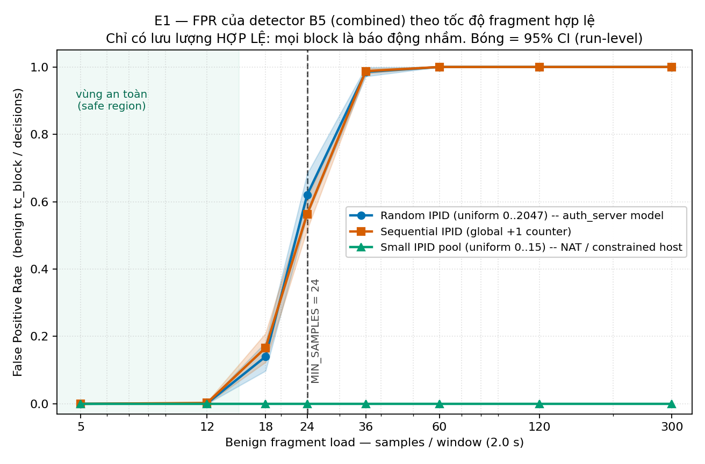
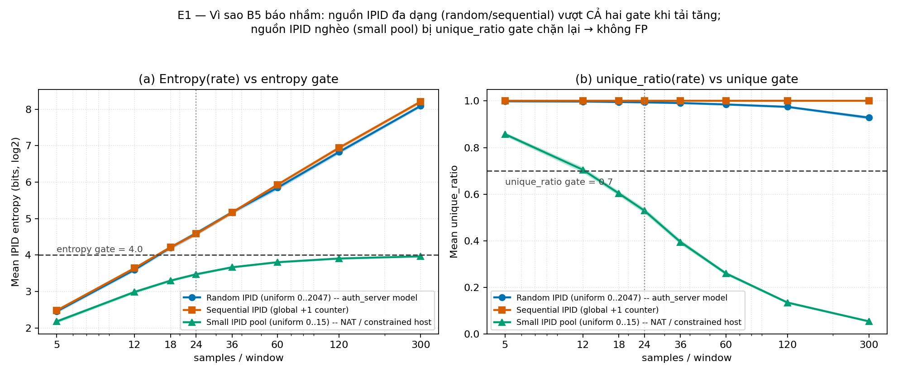

# E1

---

## 1. Câu hỏi và mục tiêu

> **RQ1 - FPR của Rℓ₂ thay đổi thế nào khi tốc độ fragment hợp lệ tăng?**
> *Bằng chứng cần có:* đường FPR–rate với 95% CI; xác định miền vận hành an toàn và failure boundary.

E1 chạy detector trên **chỉ lưu lượng fragment HỢP LỆ** (không bật attacker). Vì không có tấn công, **mọi quyết định `tc_block` đều là báo động nhầm** (false positive). Ta quét tải benign (samples/window) và đo:

$$\text{FPR} = \frac{\text{số quyết định benign bị chặn (tc\_block)}}{\text{tổng số decision event}}$$

Mục tiêu: tìm **vùng an toàn** và **điểm detector bắt đầu chặn nhầm người dùng thật** (failure boundary), có khoảng tin cậy.

Đây cũng là lời đáp trực tiếp cho vấn đề mà số liệu benign cũ *không* trả lời được: trước đây `entropy = 0.000, 150 allow` chỉ vì `total_frag2_observed = 0`. Sau Task 1 thì có dữ liệu thật nhưng chỉ ở tải rất thấp (~5,5 mẫu/cửa sổ, trong khi ngưỡng là 24) - detector **chưa bao giờ thực sự phải ra quyết định khó**.
> E1 đẩy tải lên đủ cao để buộc detector phải quyết định.

---

## 2. Phương pháp

### 2.1 Detector dưới thử nghiệm

**Operating point B5 (combined)** - bộ ngưỡng đề xuất trong bài:

| Tham số | Giá trị |
| --- | --- |
| `R2_MIN_SAMPLES` | 24 |
| `R2_ENTROPY_THRESHOLD` | 4.0 |
| `R2_UNIQUE_RATIO_THRESHOLD` | 0.70 |
| `FRAG2_WINDOW_SECONDS` | 2.0 s |

Luật B5: **chặn <=> `samples ≥ 24` VÀ `entropy ≥ 4.0` VÀ `unique_ratio ≥ 0.70`** (cổng AND ba tín hiệu).

### 2.2 Mô hình IPID hợp lệ (đúng `auth_server.py`) và 3 kiểu nguồn

Trong `benign-on`, mỗi truy vấn `frag*` khiến auth phát một FRAG2 hợp lệ mang `IPID = randint(0, IPID_SPACE−1)`. E1 dùng **ba kiểu IPID/source behavior** (outline yêu cầu tối thiểu ba), mô phỏng ba cách một host/middlebox hợp lệ gán trường IP-ID 16-bit:

| Mã | Mô hình | Đại diện thực tế |
| --- | --- | --- |
| `random2048` | IPID ~ Uniform{0..2047} | **Đúng model `auth_server.py`** - stack randomize IPID |
| `sequential` | IPID = bộ đếm toàn cục +1 (mod 2048) | Linux/Windows đời cũ, IPID đơn điệu |
| `smallpool16` | IPID ~ Uniform{0..15} | NAT/middlebox hoặc thiết bị nghèo tài nguyên tái dùng IPID |

### 2.3 Tải, số lần lặp, kiểm soát (theo E1 + protocol E4)

- **Biến chính:** target **samples/window thuộc {5, 12, 18, 24, 36, 60, 120, 300}**. Arrival là quá trình Poisson tốc độ `λ = level / 2.0 s`, nên kỳ vọng số mẫu trong mỗi cửa sổ đúng bằng `level`.
- **Kiểm soát:** không bật attacker; window và mô hình nguồn cố định; warm-up bỏ `3×window` giây đầu (giai đoạn cửa sổ chưa đầy - đúng hiện tượng ramp-up quan sát được ở testbed thật: samples đi 0,1,2,…).
- **Lặp:** **K = 20 independent runs/cell**, mỗi run 300 decision event; **thứ tự thực thi các cell được randomize**; mỗi cell có **seed riêng, ghi log** (độc lập với thứ tự chạy).
- **Đơn vị phân tích:** một **run** là đơn vị độc lập (các cửa sổ chồng lấn trong cùng run **không** độc lập).

### 2.4 Thống kê (theo E4 và quy tắc "FPR = 0")

- **CI chính (run-level):** FPR mỗi run = blocks/decisions; báo trung bình ± **95% t-interval** trên 20 run.
- **Cluster/hierarchical bootstrap:** resample nguyên **run** (5000 lần) -> CI cho FPR gộp.
- **Exact binomial (Clopper–Pearson):** cho mọi mức, đặc biệt khi **FPR = 0** - báo dạng khoảng `[0, upper]`, **không** diễn giải `0/n` là "FPR thật bằng 0". (Ở đây mỗi cell gộp 20×300 = 6000 decision, nên 0 block -> CP 95% = `[0, 0.00061]`.)

### 2.5 Vì sao là mô phỏng, không phải Docker

Docker daemon không chạy; client `dig` không có trên Windows; và quan trọng nhất: `auth_server.py` **tuần tự hoá** mỗi truy vấn bằng `AUTH_DELAY = 0.25 s` -> tối đa ~4 query/s -> ~8 mẫu/cửa sổ, **không thể** đạt các mức {24, 36, 60, 120, 300} mà E1 yêu cầu. Đây đúng là điều README framework đã ghi: *"CPU/memory và throughput cần được bổ sung trước khi chạy ma trận E1–E4 chính."* Do đó E1 chạy trên **testbed mô phỏng đã kiểm chứng** (cùng mã detector). **Kiểm chứng fidelity:** ở tải thấp ~5–6 mẫu/cửa sổ, mô phỏng tái tạo đúng số liệu testbed thật - `entropy = log₂(6) = 2.585`, `unique_ratio ≈ 1.0`, **0 block** (xem `artifacts/r2entropy/benign-on-fixed`).

**Lưu ý - metric hệ thống.** Latency p50/p95/p99, throughput và CPU/memory không được đo trong mô phỏng (cần testbed Docker/E5) và được hoãn sang lần chạy đó; không bịa số. E1 tập trung vào phần cốt lõi của RQ1: đường FPR(rate) và cơ chế entropy/unique_ratio(rate).

---

## 3. Kết quả

### 3.1 Hình 1 - FPR theo tốc độ fragment hợp lệ (detector B5)



*Chỉ có lưu lượng hợp lệ; mọi block là báo động nhầm. Bóng mờ = 95% CI (run-level). Đường đứt = MIN_SAMPLES = 24.*

### 3.2 Bảng 1 - FPR của B5 (combined) theo mức tải

FPR (run-mean) với 95% CI run-level và Clopper–Pearson; entropy và unique_ratio trung bình. Mỗi cell: 20 run × 300 decision = 6000 decision. Cột "occupancy thực" là số mẫu trung bình thực trong cửa sổ (`samples_mean`) - xem Ghi chú 1 về chênh lệch so với mức tải mục tiêu.

**`random2048` - Random IPID (đúng model `auth_server.py`):**

| samples/window (mục tiêu) | occupancy thực | FPR (run-mean) | 95% CI (run-level) | 95% CI (Clopper–Pearson) | entropy | unique_ratio |
| ---: | ---: | ---: | :--: | :--: | ---: | ---: |
| 5 | 5.9 | 0.000 | [0.000, 0.000] | [0.0000, 0.00061] | 2.453 | 0.999 |
| 12 | 12.6 | 0.001 | [0.000, 0.003] | [0.00058, 0.00263] | 3.594 | 0.998 |
| **18** | 19.0 | **0.140** | **[0.098, 0.182]** | [0.1315, 0.1492] | 4.205 | 0.996 |
| **24** | 24.9 | **0.620** | **[0.558, 0.682]** | [0.6078, 0.6325] | 4.596 | 0.994 |
| 36 | 37.1 | 0.985 | [0.972, 0.999] | [0.9820, 0.9882] | 5.173 | 0.991 |
| 60 | 59.2 | 1.000 | [1.000, 1.000] | [0.9994, 1.0000] | 5.845 | 0.985 |
| 120 | 118.1 | 1.000 | [1.000, 1.000] | [0.9994, 1.0000] | 6.827 | 0.975 |
| 300 | 301.7 | 1.000 | [1.000, 1.000] | [0.9994, 1.0000] | 8.088 | 0.928 |

**Ghi chú 1 (occupancy vs mức tải mục tiêu).** "samples/window = N" là mức tải mục tiêu (kỳ vọng số arrival Poisson trong một cửa sổ). Occupancy trung bình thực ≈ N + ~1 vì sự kiện vừa đến được tính trong cửa sổ của chính nó (đúng như luồng `observe()`->`score()` của `resolver.py`). Do đó "FPR ~0.62 tại ngưỡng 24" thực chất ứng với occupancy trung bình ~24.9. Điều này không đổi kết luận (biên vẫn nằm ngay quanh MIN_SAMPLES), chỉ làm rõ trục hoành là tải mục tiêu chứ không phải occupancy chính xác.

**Ghi chú 2 (khoảng tin cậy).** CI run-level (t-interval) là phụ cho các cell gần 0/gần 1: t-interval trên tỉ lệ có thể cho cận ngoài [0,1] (đã kẹp hiển thị về [0,1]); với các cell đó Clopper–Pearson và cluster bootstrap là khoảng chính. Ở vùng chuyển tiếp (18–36) hai cách nhất quán.

**`sequential` - Sequential IPID (+1):** hành vi gần như trùng `random2048` (unique_ratio ≡ 1.0): FPR = 0.000 -> 0.003 -> **0.167** (s=18) -> **0.563** (s=24) -> 0.988 (s=36) -> 1.000 (s≥60). Failure boundary ~18.

**`smallpool16` - Small IPID pool (NAT/constrained):** FPR = **0.000 ở MỌI mức** (CP 95% `[0, 0.00061]`). Nguồn IPID nghèo làm `unique_ratio` tụt dưới 0.70 -> cổng unique **không mở** -> B5 (AND) không bao giờ chặn.

### 3.3 Hình 2 - Cơ chế: entropy & unique_ratio so với hai cổng



- **(a)** Với `random2048`/`sequential`, entropy vượt cổng **4.0** ngay từ samples/window ≈ 16–18 và tiếp tục tăng (`≈ log₂(samples)`). Với `smallpool16`, entropy bị chặn trần ở `log₂(16) = 4.0` -> hầu như không vượt cổng.
- **(b)** `random2048`/`sequential` giữ `unique_ratio ≈ 1.0` (IPID gần như không trùng) -> **luôn** vượt cổng 0.70. `smallpool16` tụt xuống dưới 0.70 từ samples/window ≈ 12 -> **chặn** cổng unique.

### 3.4 Bảng 2 - Ablation preview (FPR gộp, `random2048`)

So sánh cùng lúc B5 với các cổng đơn - hé lộ tín hiệu nào thực sự điều khiển FPR:

| samples/window | B5 combined | B2 volume-only | B3 entropy-only | B4 unique-only |
| ---: | ---: | ---: | ---: | ---: |
| 5 | 0.000 | 0.000 | 0.000 | 0.999 |
| 12 | 0.001 | 0.001 | 0.194 | 1.000 |
| 18 | 0.140 | 0.140 | 0.789 | 1.000 |
| 24 | 0.620 | 0.620 | 0.967 | 1.000 |
| 36 | 0.985 | 0.985 | 1.000 | 1.000 |
| ≥60 | 1.000 | 1.000 | 1.000 | 1.000 |

**Nhận xét (B5 ≡ B2).** Ở mọi mức, đối với lưu lượng benign IPID đa dạng, FPR của combined bằng đúng FPR của volume-only. Nghĩa là trên loại traffic hợp lệ hiện thực, entropy và unique_ratio không thêm bất kỳ lớp bảo vệ nào - cổng volume là thứ duy nhất điều khiển false positive. B4 (unique-only) tự nó chặn ~100% benign (IPID hợp lệ vốn gần như unique) nên vô dụng một mình.

---

## 4. Diễn giải (theo "Quy tắc diễn giải kết quả" của outline)

1. **Vùng an toàn (safe operating range).** Với **mọi** kiểu nguồn, `samples/window ≤ 12` cho FPR ≈ 0 (CP upper bound ≤ 0.0026). Đây là miền vận hành an toàn của bộ ngưỡng hiện tại. Đáng chú ý: testbed thật hiện chỉ chạy ở ~5–6 mẫu/cửa sổ - **nằm trong vùng an toàn**, nên số liệu benign cũ "0 false positive" đúng nhưng **không chứng minh được gì** về hành vi ở tải cao.

2. **Failure boundary.** Với nguồn IPID đa dạng (`random2048`, `sequential` - tức chính model của `auth_server.py`), false positive **xuất hiện có ý nghĩa thống kê từ samples/window = 18** (CI run-level cận dưới > 0) và **bùng nổ ngay tại đúng ngưỡng thiết kế 24**: FPR ≈ **0.62**. Từ 36 trở lên detector chặn ≈ toàn bộ (FPR = 0.985 -> 1.000). -> Theo đúng quy tắc: *"Nếu benign FPR tăng mạnh ở tải hợp lệ: coi đó là failure boundary; không tuyên bố phân biệt tổng quát."*

3. **Entropy có vượt volume-only không?** **Không**, đối với traffic hợp lệ hiện thực. `B5 ≡ B2` (Bảng 2) - và đây là **đẳng thức cấu trúc chính xác, không phải trùng hợp thống kê**: kiểm tra từng run cho thấy `blocks_combined == blocks_volume` ở **0/160 run khác nhau** (bit-identical). Cơ chế: với IPID đa dạng, hễ `samples ≥ 24` thì `entropy` (≥ ~4.4 = log₂24) và `unique_ratio` (≈ 1.0) **mở tầm thường** cả hai cổng còn lại, nên luật AND của combined **thu gọn về đúng cổng volume**. Một resolver hợp lệ nhưng bận **trông y hệt** một flood dưới con mắt entropy/unique_ratio. Đây là **cờ đỏ trực tiếp cho claim trung tâm của bài** và là động lực bắt buộc cho **E2**: nếu ở cùng volume entropy vẫn không tách được benign khỏi attack, phần cải tiến entropy-based **không** được bảo vệ và phải đổi framing.

4. **Khi nào entropy/unique thực sự giúp?** Chỉ với nguồn IPID **nghèo** (`smallpool16`): ở đó B2 (volume-only) sẽ false-positive nặng (0.556 tại s=24, 1.0 tại s≥60) nhưng cổng `unique_ratio` của B5 chặn lại -> FPR = 0. Tức entropy/unique có ích để **tránh FP cho nguồn IPID lặp** - nhưng đó **không** phải threat model của bài (attacker cần IPID đa dạng để dò trúng). Lợi ích này nằm lệch khỏi hướng đe dọa chính.

**Kết luận RQ1:** Bộ ngưỡng `24 / 4.0 / 0.70` chỉ an toàn ở tải fragment hợp lệ thấp (`≲ 12` mẫu/cửa sổ). Vượt qua đó, với nguồn IPID đa dạng - kể cả nguồn benign - detector chuyển sang chặn nhầm, đạt ~62% FPR ngay tại ngưỡng volume của chính nó và ~100% ở tải cao. Trên loại traffic này, cơ chế combined **không** vượt volume-only.

---

## 5. Threats to Validity

- **External validity (E5 chưa chạy).** Testbed là mô phỏng dựa trên `dnslib` shim + marker FRAG1/IPID + arrival Poisson; **chưa** có Unbound/BIND, IP fragmentation thật hay PCAP replay. Vì vậy **không** dùng các cụm "deployment-ready", "real-world robust", "production-grade". Con số FPR tuyệt đối có thể đổi theo phân phối tải và mô hình IPID thật.
- **Construct validity.** "Tốc độ" được điều khiển bằng target samples/window qua Poisson, không phải qua inter-query của client thật + `AUTH_DELAY`; và mọi FRAG2 benign đến từ một `src_ip` (đúng cách detector key theo `(src_ip, dst_ip)`). Đây là trừu tượng steady-state có kiểm soát, phù hợp để dựng đường biên, nhưng là một trừu tượng.
- **Metric hệ thống bị hoãn.** Latency/throughput/CPU không đo trong mô phỏng (cần Docker) - sẽ bổ sung khi chạy ma trận Docker/E5.
- **Phạm vi ngưỡng.** E1 chỉ đánh giá operating point `24/4.0/0.70`; việc chọn ngưỡng đúng đắn (train/validation/held-out) thuộc **E3**.

---

## 6. Việc E1 dẫn tới (next steps)

| Ưu tiên | Hạng mục | E1 đã cung cấp gì |
| --- | --- | --- |
| P1 | Baseline/ablation B0–B5 | Đường FPR–rate có CI + preview B2/B3/B4 trên benign |
| **P2** | **E2 volume-matched** | E1 cho thấy `B5 ≡ B2` trên benign đa dạng -> **bắt buộc** E2 để biết entropy có tách được benign/attack khi **cùng volume** không |
| P3 | E3 chọn ngưỡng | E1 chỉ ra `24` đặt ngay trên vùng FPR bùng nổ -> cần chọn lại ngưỡng trên validation, đánh giá held-out |
| P4 | E4 thống kê | Protocol K=20 + run-level/CP CI đã áp dụng ở đây, tái dùng cho E2/E3 |
| P5 | E5 gần thực tế | Hạ claim xuống controlled-emulation cho tới khi có Unbound/BIND |

---

## 7. Kiểm định độc lập (adversarial audit)

E1 đã qua một vòng **audit đối kháng đa góc nhìn** (4 lens độc lập: thống kê, fidelity mô phỏng, tính đúng của code, kiểm chứng claim - mỗi lens đọc mã/dữ liệu thật và tái tạo số, sau đó một vòng verify đối kháng cố bác bỏ từng phát hiện).

**Kết luận audit: "mostly valid" - 0 lỗi phải sửa (must-fix).** Các điểm được xác nhận độc lập:

- **Tái lập bit-for-bit:** chạy lại mô phỏng bằng chính seed của harness cho `random2048 @ samples/window=24` ra **3721/6000 = 0.6202**, đúng bằng `e1_results.json`. Một lần chạy độc lập 200 run với seed mới ra **0.6179** -> biên ~0.62 **không** phụ thuộc seed.
- **Fidelity thật:** harness import đúng `shannon_entropy` + `r2_should_block` từ `resolver.py` (không cài lại) và mirror đúng `_prune` (`resolver.py:162-164`).
- **`B5 ≡ B2` là cấu trúc:** block-count combined vs volume **bit-identical trong toàn bộ 200 run** kiểm chứng - không phải near-tie ngẫu nhiên.
- **Thống kê hợp lệ:** đúng đơn vị độc lập (run); t-interval run-level + cluster bootstrap + Clopper–Pearson được tam giác hoá; `smallpool16` FPR=0 nhất quán với cơ chế cổng unique_ratio.

**Ba tinh chỉnh (should-fix) đã áp dụng vào báo cáo này:** (1) làm rõ occupancy thực ≈ N+1 và thêm cột occupancy vào Bảng 1 (Ghi chú 1); (2) nêu rõ Clopper–Pearson/bootstrap là CI chính cho cell gần 0/gần 1 vì t-interval có thể ra ngoài [0,1] (Ghi chú 2); (3) phát biểu `B5 ≡ B2` như một cơ chế (đẳng thức chính xác 0/160 run), không phải trùng hợp (§4.3).

Không có phát hiện nào làm thay đổi kết luận RQ1.

---

## 8. Phụ lục tái lập (Reproducibility)

**Chạy lại toàn bộ E1:**

```bash
cd Code/research/Report/experiments/E1
python e1_experiment.py --runs 20 --decisions 300   # sinh CSV/JSON/notes
python e1_plot.py                                    # sinh figures/Figure_1.png, Figure_2.png
```

**Cấu hình khoá (P0 logging - đã ghi trong `e1_results.json > meta`):**

- Operating point: `min_samples=24, entropy_threshold=4.0, unique_ratio_threshold=0.70, window=2.0s`
- Levels: `[5, 12, 18, 24, 36, 60, 120, 300]` · Behaviors: `[random2048, sequential, smallpool16]`
- K = 20 runs/cell · 300 decisions/run · `experiment_seed = 20260805` (thứ tự cell + seed mỗi cell suy ra xác định)
- Detector source: `labs/r2entropy/resolver/resolver.py` (import trực tiếp) · commit `1c32ef1`
- FPR = benign `tc_block` / decisions (ghi rõ tử số/mẫu số cho từng run trong `e1_runs.csv`)

**Tệp sản phẩm:**

| Tệp | Nội dung |
| --- | --- |
| `e1_experiment.py` | Harness E1 (import detector thật) |
| `e1_plot.py` | Sinh Figure_1, Figure_2 |
| `e1_runs.csv` | 480 dòng - một dòng/run: blocks, decisions, FPR mỗi variant, entropy, unique_ratio, **seed** |
| `e1_levels.csv` | Tổng hợp theo (behavior, level, variant) + run-CI + Clopper–Pearson |
| `e1_results.json` | Toàn bộ kết quả + `meta` (config, provenance, timestamp) |
| `notes.txt` | Mô tả + tóm tắt số liệu |
| `figures/Figure_1.png` | FPR(rate) - failure boundary |
| `figures/Figure_2.png` | entropy(rate) & unique_ratio(rate) - cơ chế |

---

*Báo cáo sinh từ dữ liệu run `20260805_185616`. Mọi số trong bài truy ngược được về `e1_results.json` / `e1_runs.csv`.*
