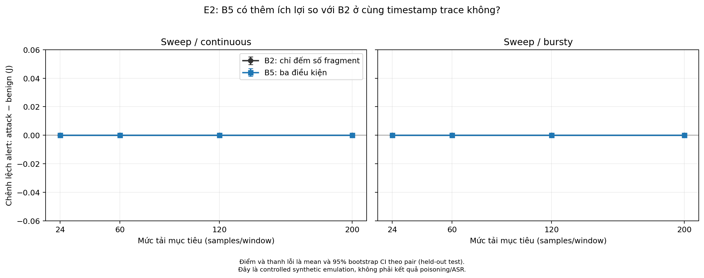
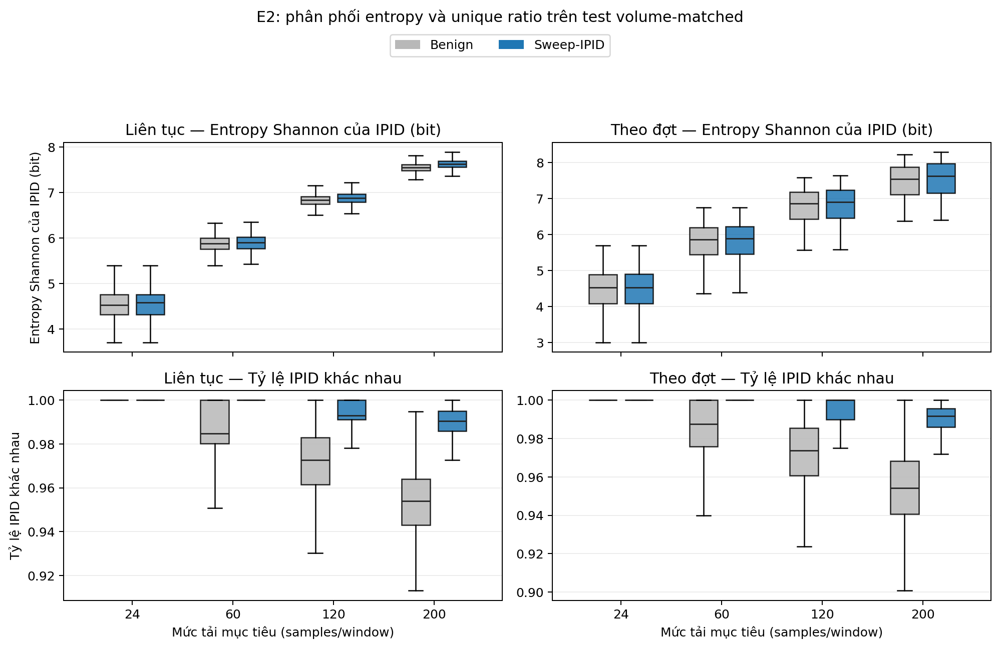

# E2 — Volume-matched benign vs attack của rule Rℓ2 ba biến

## 1. Mục tiêu

Rule đề xuất B5 block khi đồng thời đạt ba điều kiện trong cửa sổ 2 giây:

\[
B5 = [n \ge 24] \land [H \ge 4{,}0] \land [U \ge 0{,}70],
\]

trong đó \(n\) là số FRAG2, \(H\) là entropy Shannon của IPID và \(U\) là tỷ lệ IPID khác nhau. B1 là POPS/Rℓ2 gốc. B2, B3 và B4 lần lượt là ablation volume-only, entropy-only và unique-only; B0 là cấu hình không phòng vệ.

E2 đánh giá khả năng phân biệt của các cấu hình B2–B5 khi benign và attack có cùng volume. Phân tích chính là \(\Delta J = J_{B5}-J_{B2}\); B5 cũng được so sánh ghép cặp với B1, B3 và B4.

## 2. Thiết kế thí nghiệm

E2 dùng thiết kế ghép cặp theo thời gian. Mỗi benign/attack pair có cùng lịch FRAG2, lịch query, cửa sổ 2 giây, burstiness và thời lượng đo; chỉ mô hình sinh IPID thay đổi. `max_abs_paired_samples_difference = 0` cho toàn bộ pair trên test.

**Bảng 1. Thiết kế E2.**

| Hạng mục | Thiết kế |
| --- | --- |
| Mức volume | 24, 60, 120 và 200 samples/window |
| Profile lưu lượng | Poisson liên tục; Non-Homogeneous Poisson Process |
| Nguồn/đích | Không biến thiên trong controlled emulation |
| Attack chính | Sweep-IPID liên tục; sweep-IPID theo đợt |
| Đối chứng/probe | Random-IPID; fixed-IPID; duplicate-sweep IPID |
| Cửa sổ và warm-up | 2 giây; 6 giây |
| Đơn vị độc lập | Một pair dùng chung timestamp trace |
| Test | 20 pair/ô, 150 decision/run; 560 condition-run, 84.000 decision |
| Split | Calibration 10 run/ô; validation 10 run/ô; test held-out 20 run/ô |

E2 không có biến thể adaptive/high-entropy. Đây là biến thể khuyến nghị trong outline, không phải điều kiện bắt buộc của E2.

Chỉ số phân tách trong E2 là:

\[
J = \text{tỷ lệ kích hoạt trên mẫu kiểm tra}

- \text{tỷ lệ kích hoạt trên lưu lượng hợp lệ}.
\]

Giá trị \(J\) càng lớn thì luật càng tách được hai nhóm. Khoảng tin cậy được ước lượng bằng 5.000 lần bootstrap trên 20 pair; các cửa sổ chồng lấn trong một run không được coi là mẫu độc lập.

Phân tích báo cáo TPR, FNR, FPR, precision, PR-AUC và \(\Delta J\) ghép cặp với CI 95%. Với các score liên tục, ngưỡng được khóa trên validation tại TPR mục tiêu 0,95 rồi đánh giá một lần trên held-out test.

## 3. Kết quả chính

### 3.1. Các mẫu IPID đa dạng

E2 dùng ba mẫu IPID đa dạng: quét tuần tự liên tục, quét tuần tự theo đợt và IPID ngẫu nhiên. Bảng 2 ghi riêng tỷ lệ kích hoạt trên benign và attack để tính \(J\).

*Hình 1. \(J\) của B2 và B5 trên hai sweep chính; điểm là trung bình, thanh lỗi là CI bootstrap 95% theo pair.*

**Cách đọc và ý nghĩa Hình 1.**

- Mỗi nửa hình là một profile attack: sweep liên tục ở bên trái và sweep theo đợt ở bên phải; trục ngang là mức tải, trục dọc là chênh lệch tỷ lệ cảnh báo attack trừ benign \(J\). \(J>0\) mới biểu thị có phân biệt được attack với lưu lượng hợp lệ.
- Hai đường B2 và B5 chồng khít tại \(J=0\) ở cả bốn mức tải. Nghĩa là trong từng cặp volume-matched, hai rule kích hoạt với cùng tỷ lệ trên benign và attack; thanh lỗi bằng 0 vì kết quả này lặp lại nhất quán trên các pair.
- Vì B5 không dịch đường lên phía trên B2, việc thêm entropy và unique ratio chưa tạo lợi ích phân biệt ở operating point `24/4,0/0,70`.

**Bảng 2. Kết quả B2 và B5 trên các mẫu IPID đa dạng.**

| Mẫu kiểm tra | Tải | Hợp lệ — B2 | Kiểm tra — B2 | Hợp lệ — B5 | Kiểm tra — B5 | \(\Delta J\), CI 95% |
| --- | ---: | ---: | ---: | ---: | ---: | ---: |
| Sweep liên tục | 24 | 0,510 | 0,510 | 0,510 | 0,510 | 0,000 [0,000; 0,000] |
| Sweep liên tục | 60–200 | 1,000 | 1,000 | 1,000 | 1,000 | 0,000 [0,000; 0,000] |
| Sweep theo đợt | 24 | 0,494 | 0,494 | 0,494 | 0,494 | 0,000 [0,000; 0,000] |
| Sweep theo đợt | 60 | 0,999 | 0,999 | 0,999 | 0,999 | 0,000 [0,000; 0,000] |
| Sweep theo đợt | 120–200 | 1,000 | 1,000 | 1,000 | 1,000 | 0,000 [0,000; 0,000] |
| IPID ngẫu nhiên | 24 | 0,510 | 0,510 | 0,510 | 0,510 | 0,000 [0,000; 0,000] |
| IPID ngẫu nhiên | 60–200 | 1,000 | 1,000 | 1,000 | 1,000 | 0,000 [0,000; 0,000] |

Trên hai sweep chính, \(\Delta J\) trung bình của B5 so với B2 bằng 0,000, CI 95% [0,000; 0,000]. Random-IPID cũng cho \(\Delta J=0\) ở mọi mức tải. Do đó, E2 không cung cấp bằng chứng rằng entropy và unique ratio cải thiện khả năng phân biệt độc lập với volume tại operating point `24/4,0/0,70`.

### 3.2. Các phép thử IPID cố định và lặp

E2 còn có hai phép thử giới hạn: một mẫu dùng IPID cố định và một mẫu lặp lại các IPID. Chúng được dùng để kiểm tra hành vi của luật khi độ đa dạng IPID thấp; chúng không đại diện trực tiếp cho kết quả tấn công đầu-cuối.

**Bảng 3. Kết quả B2 và B5 khi IPID có độ đa dạng thấp.**

| Mẫu kiểm tra | Tải | Hợp lệ — B2 | Kiểm tra — B2 | Hợp lệ — B5 | Kiểm tra — B5 | \(\Delta J\), CI 95% |
| --- | ---: | ---: | ---: | ---: | ---: | ---: |
| IPID cố định | 24 | 0,510 | 0,510 | 0,510 | 0,000 | −0,510 [−0,545; −0,470] |
| IPID lặp | 24 | 0,510 | 0,510 | 0,510 | 0,000 | −0,510 [−0,545; −0,472] |
| IPID cố định | 60–200 | 1,000 | 1,000 | 1,000 | 0,000 | −1,000 [−1,000; −1,000] |
| IPID lặp | 60–200 | 1,000 | 1,000 | 1,000 | 0,000 | −1,000 [−1,000; −1,000] |

*Hình 2. \(\Delta J=J_{B5}-J_{B2}\) theo condition và mức volume; thanh lỗi là CI bootstrap 95% theo pair.*

**Cách đọc và ý nghĩa Hình 2.**

- Đường ngang tại 0 là mốc B5 và B2 cho cùng khả năng phân biệt; vùng xám \(\pm0{,}05\) là biên tương đương thực tiễn đã đăng ký trước. Điểm nằm phía trên 0 mới là bằng chứng B5 tốt hơn B2.
- Hai sweep chính và random-IPID đều nằm đúng tại 0, trong vùng tương đương, ở mọi mức tải. Do đó không có bằng chứng B5 được lợi từ hai biến IPID trên các condition này.
- Hai probe IPID cố định và lặp nằm ở \(-0{,}510\) tại tải 24, rồi \(-1{,}000\) từ tải 60 trở lên: điều kiện entropy/unique khiến B5 không cảnh báo, trong khi B2 vẫn cảnh báo. Đây là failure case tổng hợp cần được giữ làm ràng buộc khi chọn lại ngưỡng, không phải kết luận trực tiếp về tấn công đầu-cuối.

Ở fixed-IPID và duplicate-sweep, \(J_{B5}\) thấp hơn B2: −0,510 tại tải 24 và −1,000 từ tải 60 trở lên. Đây là failure case của operating point `24/4,0/0,70`.

### 3.3. Baseline/ablation B0–B5 và hiệu ứng ghép cặp của B5

Để khớp đầy đủ baseline/ablation, cùng một test split được tổng hợp cho B0 (không phòng vệ), B1 (POPS/Rℓ2 gốc, luôn block trong emulation), B2/B3/B4 (ba ablation một biến), và B5 (rule ba biến đề xuất). Ở sweep liên tục, bảng dưới cho các tỷ lệ tại ngưỡng rule đã đăng ký; TPR/FNR/FPR ở đây là chỉ số trên hai condition tổng hợp, không phải attack outcome thực tế.

**Bảng 4. Baseline/ablation B0–B5 trên sweep liên tục.**

| Tải | Biến thể | TPR tổng hợp | FNR tổng hợp | FPR tổng hợp | Precision 50:50 | \(J\) |
| ---: | --- | ---: | ---: | ---: | ---: | ---: |
| 24 | B0 — Không phòng vệ | 0,000 | 1,000 | 0,000 | 0,000 | 0,000 |
| 24 | B1 — Rℓ2 gốc | 1,000 | 0,000 | 1,000 | 0,500 | 0,000 |
| 24 | B2 — volume-only | 0,510 | 0,490 | 0,510 | 0,500 | 0,000 |
| 24 | B3 — entropy-only | 0,953 | 0,047 | 0,950 | 0,501 | 0,002 |
| 24 | B4 — unique-only | 1,000 | 0,000 | 1,000 | 0,500 | 0,000 |
| 24 | B5 — combined | 0,510 | 0,490 | 0,510 | 0,500 | 0,000 |
| 60–200 | B0 — Không phòng vệ | 0,000 | 1,000 | 0,000 | 0,000 | 0,000 |
| 60–200 | B1, B2, B3, B4 hoặc B5 | 1,000 | 0,000 | 1,000 | 0,500 | 0,000 |

Ở sweep theo đợt, B2 và B5 cùng \(J=0\) tại mọi tải; B3 có \(J\) xấp xỉ 0,002 tại tải 24. Bảng đầy đủ từng tải và từng variant nằm trong artifact.

**Bảng 5. \(\Delta J\) ghép cặp của B5 so với từng baseline, trung bình bốn mức tải.**

| Mẫu kiểm tra | B5 so với | \(\Delta J\), CI 95% | Kết luận theo biên ±0,05 đã đăng ký |
| --- | --- | ---: | --- |
| Sweep liên tục | B1 | 0,000 [0,000; 0,000] | Tương đương thực tiễn |
| Sweep liên tục | B2 | 0,000 [0,000; 0,000] | Tương đương thực tiễn |
| Sweep liên tục | B3 | −0,001 [−0,001; 0,000] | Tương đương thực tiễn |
| Sweep liên tục | B4 | 0,000 [0,000; 0,000] | Tương đương thực tiễn |
| Sweep theo đợt | B1 | 0,000 [0,000; 0,000] | Tương đương thực tiễn |
| Sweep theo đợt | B2 | 0,000 [0,000; 0,000] | Tương đương thực tiễn |
| Sweep theo đợt | B3 | −0,001 [−0,002; −0,001] | Tương đương thực tiễn |
| Sweep theo đợt | B4 | 0,000 [0,000; 0,000] | Tương đương thực tiễn |

Mọi CI 90% nằm trong biên \(\pm0{,}05\). E2 không ghi nhận B5 vượt B1–B4 về \(J\) trên hai sweep chính.

### 3.4. Phân phối entropy và unique ratio

Hình 3 trình bày phân phối entropy và unique ratio trên held-out test của hai attack chính và benign tương ứng, tại từng mức volume.

**Cách đọc và ý nghĩa Hình 3.**

- Màu xám là benign và màu xanh là sweep-IPID; hàng trên là entropy, hàng dưới là unique ratio; cột trái là liên tục và cột phải là theo đợt. Đường trong hộp là trung vị, hộp biểu thị 50% quan sát ở giữa, còn râu biểu thị độ phân tán của số liệu.
- Entropy tăng theo volume ở cả benign lẫn attack và hai phân phối chồng lấn nhiều. Vì vậy entropy đơn lẻ chỉ có tín hiệu yếu trong E2, phù hợp với PR-AUC chỉ tăng từ 0,514 lên 0,726 trên sweep liên tục.
- Unique ratio tách rõ hơn khi tải tăng: ở tải 120 và 200, benign có trung vị thấp hơn và phân tán rộng hơn, còn sweep-IPID tập trung gần 1. Đây là lý do PR-AUC của unique ratio đạt 0,888 và 0,992 tương ứng.
- Tuy vậy, ngưỡng cố định \(U\ge0{,}70\) của B5 quá thấp so với cả hai phân phối nên hầu như benign và attack đều vượt ngưỡng. Khoảng cách score nhìn thấy trong hình vì thế chưa làm \(J\) của B5 tốt hơn B2.

### 3.5. PR-AUC và FPR tại TPR mục tiêu

PR-AUC được tính theo từng pair cho các score liên tục. Ngưỡng của từng score được khóa trên validation tại TPR mục tiêu 0,95 và chỉ đánh giá một lần trên held-out test.

**Bảng 6. PR-AUC của từng tín hiệu trên sweep liên tục.**

| Tải | Số mảnh IP | Entropy | Tỷ lệ IPID khác nhau |
| ---: | ---: | ---: | ---: |
| 24 | 0,500 | 0,514 | 0,530 |
| 60 | 0,500 | 0,550 | 0,666 |
| 120 | 0,500 | 0,618 | 0,888 |
| 200 | 0,500 | 0,726 | 0,992 |

**Bảng 7. FPR trên test ở ngưỡng khóa validation với TPR mục tiêu 0,95.**

| Tải | Score | PR-AUC | TPR test | FPR test | Precision 50:50 |
| ---: | --- | ---: | ---: | ---: | ---: |
| 24 | Volume | 0,500 | 0,969 | 0,969 | 0,500 |
| 24 | Entropy | 0,514 | 0,968 | 0,967 | 0,500 |
| 24 | Unique ratio | 0,530 | 0,973 | 0,863 | 0,530 |
| 60 | Volume | 0,500 | 0,963 | 0,963 | 0,500 |
| 60 | Entropy | 0,550 | 0,960 | 0,944 | 0,504 |
| 60 | Unique ratio | 0,666 | 0,939 | 0,605 | 0,610 |
| 120 | Volume | 0,500 | 0,954 | 0,954 | 0,500 |
| 120 | Entropy | 0,618 | 0,945 | 0,891 | 0,515 |
| 120 | Unique ratio | 0,888 | 0,927 | 0,269 | 0,777 |
| 200 | Volume | 0,500 | 0,957 | 0,957 | 0,500 |
| 200 | Entropy | 0,726 | 0,958 | 0,851 | 0,530 |
| 200 | Unique ratio | 0,992 | 0,980 | 0,053 | 0,950 |

**Cách đọc và ý nghĩa Hình 4.**

- Hai panel lần lượt là sweep liên tục và theo đợt; mỗi điểm là FPR trên held-out test, thanh lỗi là CI bootstrap 95% theo pair. Ngưỡng được chọn độc lập trên validation cho từng profile, mức tải và score để đạt TPR mục tiêu ít nhất 0,95.
- Volume có FPR gần 1 ở mọi mức tải, còn entropy chỉ giảm nhẹ. Điều này cho thấy khi phải giữ TPR validation cao, hai score này gần như vẫn kích hoạt trên cả benign lẫn attack.
- Unique ratio giảm FPR rất mạnh khi volume tăng ở cả hai profile; trên sweep liên tục, FPR giảm từ 0,863 ở tải 24 xuống 0,053 ở tải 200, trong khi TPR test vẫn là 0,980.
- Hình này chứng minh tiềm năng của **unique ratio dưới ngưỡng được hiệu chỉnh**, chứ chưa chứng minh B5 tốt hơn B2: B5 đang dùng phép hội ngưỡng cố định khác với các ngưỡng validation-locked trong hình.

Ở tải 200, unique ratio đạt PR-AUC 0,992, TPR 0,980 và FPR 0,053. TPR trên test dao động do ngưỡng đã được khóa trước trên validation; Bảng 7 vì vậy là FPR tại cùng **mục tiêu validation** TPR, không phải FPR tại TPR test được ép bằng nhau.

## 4. Diễn giải

E2 cho ba kết quả chính:

1. B5 không vượt B2 trên hai sweep chính tại operating point `24/4,0/0,70`.
2. B5 kém B2 trên fixed-IPID và duplicate-sweep.
3. Unique ratio có khả năng xếp hạng cao ở volume 200, nhưng ngưỡng cố định của B5 chưa chuyển khoảng cách score này thành cải thiện \(J\).

Theo tiêu chí trong outline, E2 chưa bảo vệ claim rằng entropy/unique ratio tạo thêm sức phân biệt độc lập với volume ở operating point hiện tại. E3 cần chọn lại operating point trên validation và xác nhận một lần trên held-out test. E1 và E5 dùng để đánh giá false positive và hiệu quả end-to-end của B5 so với B1.

## 5. Giới hạn của thí nghiệm

E2 là mô phỏng có kiểm soát tại thời điểm truy vấn. Thí nghiệm dùng các chuỗi IPID tổng hợp, giữ topology nguồn/đích cố định và chỉ đánh giá quyết định của bộ phát hiện. Nó không tạo phân mảnh IP thật, không chạy toàn bộ quá trình xử lý của trình phân giải DNS và không đo kết quả đầu-cuối. Vì vậy, các số liệu trên không cho phép kết luận về xác suất đầu độc bộ nhớ đệm, tỷ lệ tấn công thành công, khả năng bao phủ các biến thể tấn công, độ trễ, CPU, bộ nhớ hoặc thông lượng hệ thống.

Ngoài ra, các phép thử IPID cố định và lặp chỉ cho thấy B5 không bảo toàn cảnh báo trong hai trường hợp tổng hợp này. Cần dữ liệu gói tin và tấn công thật trước khi khẳng định chúng tương ứng với một lỗ hổng an ninh có thể khai thác.

## 6. Hướng kiểm tra tiếp theo

Từ E2 có thể đặt ra ba giả thuyết cho các thí nghiệm tiếp theo; các giả thuyết này chưa được E2 chứng minh:

1. Giữ entropy và tỷ lệ IPID khác nhau ở dạng điểm liên tục có thể tốt hơn việc đưa chúng ngay qua hai ngưỡng cố định.
2. Một luật xem xét cả độ đa dạng quá cao và quá thấp có thể tránh được bất đối xứng của điều kiện một chiều hiện tại.
3. So sánh với đặc trưng hợp lệ riêng của từng nguồn có thể phù hợp hơn một bộ ngưỡng dùng chung.

E3 đã so sánh operating point trên tập chọn ngưỡng và tập held-out tách biệt.
Sau khi khóa luật, E5 đã đánh giá bằng fragment IPv4 thật và Unbound; kết quả
runtime cho thấy cần tách detector trigger khỏi poisoning outcome và chi phí
hệ thống vẫn chưa phải overhead ghép cặp.

## 7. Kết luận

E2 đánh giá B5, rule Rℓ2 kết hợp volume, entropy và unique ratio, với B1 là baseline POPS/Rℓ2 gốc và B2–B4 là ablation. Kết quả không cho thấy B5 cải thiện sức phân biệt so với B2 khi benign và attack được volume-matched; đồng thời B5 có failure case trên fixed-IPID và duplicate-sweep.

Unique ratio vẫn cho PR-AUC 0,992 và FPR 0,053 tại TPR 0,980 ở sweep tải 200. Kết quả này định hướng E3 hiệu chỉnh operating point, E1 kiểm tra false positive theo tải benign, và E5 xác nhận bằng resolver cùng IP fragmentation thật.

## 8. Dữ liệu và kiểm chứng

Số liệu được lấy từ lần chạy `E2_confirmatory_20260814_complete_b0_ablation`. Toàn chiến dịch gồm 920 lượt chạy và 138.000 quyết định. Bộ kiểm tra tự động đọc lại dữ liệu gốc, dựng lại từng cửa sổ, tính lại toàn bộ baseline/ablation, PR-AUC và FPR, rồi đạt 18/18 bước kiểm tra.

- [Protocol đã khóa](runs/E2_confirmatory_20260814_complete_b0_ablation/e2_protocol.json)
- [Kết quả tổng hợp](runs/E2_confirmatory_20260814_complete_b0_ablation/e2_results.json)
- [Bảng kết quả theo ô thí nghiệm](runs/E2_confirmatory_20260814_complete_b0_ablation/e2_summary.csv)
- [Kết quả kiểm tra dữ liệu: PASS](runs/E2_confirmatory_20260814_complete_b0_ablation/validation.json)
- [Báo cáo tự động đầy đủ của lần chạy](runs/E2_confirmatory_20260814_complete_b0_ablation/E2_report.md)
