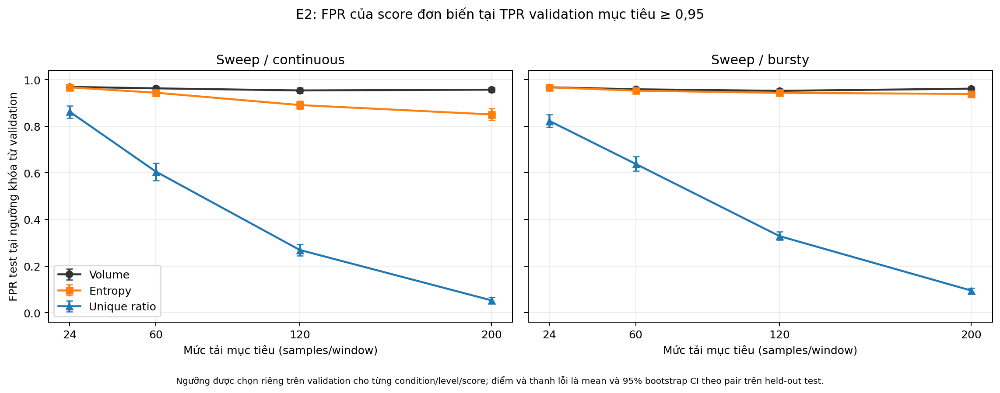

# E2 — Đánh giá giá trị bổ sung của entropy và tỷ lệ IPID khác nhau trong Rℓ2 cải tiến

## 1. Câu hỏi nghiên cứu

Trong thiết kế hiện tại, biến thể B2 kích hoạt cơ chế bảo vệ khi cửa sổ 2 giây có ít nhất 24 mảnh IP (fragment):

\[
B2 = [n \ge 24].
\]

Biến thể B5 bổ sung hai điều kiện về phân phối IPID:

\[
B5 = [n \ge 24] \land [H \ge 4{,}0] \land [U \ge 0{,}70],
\]

trong đó \(n\) là số mảnh IP trong cửa sổ, \(H\) là entropy Shannon và \(U\) là tỷ lệ IPID khác nhau. E2 kiểm tra **giá trị bổ sung chung** của hai điều kiện IPID: khi số mảnh IP đã được giữ giống nhau, B5 có phân biệt lưu lượng hợp lệ với các mẫu kiểm tra tổng hợp tốt hơn B2 hay không?

Nếu B5 chỉ lặp lại quyết định của B2 thì hai điều kiện mới chưa tạo thêm giá trị tại bộ ngưỡng đang xét. Nếu B5 loại bỏ các cảnh báo trên mẫu kiểm tra nhưng vẫn giữ cảnh báo trên lưu lượng hợp lệ, khả năng phân biệt còn có thể giảm.

## 2. Thiết kế thí nghiệm

E2 sử dụng thiết kế ghép cặp theo thời gian. Trong mỗi cặp chạy, luồng hợp lệ và luồng kiểm tra dùng đúng cùng lịch xuất hiện mảnh IP và cùng thời điểm truy vấn; chỉ cách sinh IPID được thay đổi. Số mảnh IP tại từng lần chấm điểm vì thế giống nhau hoàn toàn giữa hai phía (`max_abs_paired_samples_difference = 0`). Thiết kế này giữ cố định ảnh hưởng của lịch mảnh IP; phần chênh lệch quan sát được gắn với cách sinh IPID và các đặc trưng được tính từ nó.

Theo khung *volume-matched benign vs attack*, E2 dùng bốn mức tải 24, 60, 120 và 200 `samples/window`. Hai mẫu so sánh chính đã đăng ký trước là sweep IPID liên tục và sweep IPID theo đợt; IPID ngẫu nhiên là đối chứng. Hai probe IPID cố định và IPID lặp được bổ sung để kiểm tra xem B5 có bỏ cảnh báo khi độ đa dạng IPID thấp hay không. E2 chưa có biến thể tấn công thích nghi/high-entropy; vì vậy kết quả không được diễn giải như một phép thử khả năng né detector của đối thủ thật.

Phần kiểm định cuối gồm bốn mức tải 24, 60, 120 và 200 mảnh IP/cửa sổ. Mỗi trường hợp được lặp lại 20 lần độc lập, mỗi lần có 150 quyết định. Tập kiểm định có 560 lượt chạy và 84.000 quyết định. Hai tập dùng để kiểm tra bộ sinh dữ liệu và khóa ngưỡng có hạt giống ngẫu nhiên (seed) riêng; kết quả kiểm định không được dùng để chỉnh lại luật.

Chỉ số so sánh chính là:

\[
J = \text{tỷ lệ kích hoạt trên mẫu kiểm tra}
  - \text{tỷ lệ kích hoạt trên lưu lượng hợp lệ}.
\]

Giá trị \(J\) càng lớn thì luật càng tách được hai nhóm. Hiệu ứng bổ sung của B5 được tính bằng \(\Delta J = J_{B5} - J_{B2}\). Khoảng tin cậy được ước lượng bằng 5.000 lần bootstrap trên 20 cặp chạy độc lập. Các cửa sổ chồng lấn trong cùng một lượt chạy không bị coi là những mẫu độc lập.

Phân tích chính báo cáo tỷ lệ kích hoạt trên benign và condition attack, cùng \(\Delta J\) ghép cặp với CI 95%. Phần score-level khóa một ngưỡng riêng trên split validation để mỗi tín hiệu đạt TPR mục tiêu 0,95, rồi chỉ đo PR-AUC, TPR, FPR và precision trên test. Đây là phép so sánh FPR tại cùng **mục tiêu** TPR cho các tín hiệu liên tục; nó không thay đổi các ngưỡng rule B0–B5 đã đăng ký.

## 3. Kết quả chính

### 3.1. Các mẫu IPID đa dạng

E2 dùng ba mẫu IPID đa dạng: quét tuần tự liên tục, quét tuần tự theo đợt và IPID ngẫu nhiên. Bảng 1 ghi riêng tỷ lệ kích hoạt trên lưu lượng hợp lệ và trên mẫu kiểm tra để có thể tính lại \(J\).

*Hình 1. Khi benign và attack được ghép cùng volume/timestamp trace, B2 và B5 có cùng \(J\) trên cả sweep liên tục và sweep theo đợt. Điểm và thanh lỗi là trung bình và CI bootstrap 95% theo cặp chạy.*

**Bảng 1. Kết quả của B2 và B5 trên các mẫu IPID đa dạng.**

| Mẫu kiểm tra | Tải | Hợp lệ — B2 | Kiểm tra — B2 | Hợp lệ — B5 | Kiểm tra — B5 | \(\Delta J\), CI 95% |
| --- | ---: | ---: | ---: | ---: | ---: | ---: |
| Sweep liên tục | 24 | 0,510 | 0,510 | 0,510 | 0,510 | 0,000 [0,000; 0,000] |
| Sweep liên tục | 60–200 | 1,000 | 1,000 | 1,000 | 1,000 | 0,000 [0,000; 0,000] |
| Sweep theo đợt | 24 | 0,494 | 0,494 | 0,494 | 0,494 | 0,000 [0,000; 0,000] |
| Sweep theo đợt | 60 | 0,999 | 0,999 | 0,999 | 0,999 | 0,000 [0,000; 0,000] |
| Sweep theo đợt | 120–200 | 1,000 | 1,000 | 1,000 | 1,000 | 0,000 [0,000; 0,000] |
| IPID ngẫu nhiên | 24 | 0,510 | 0,510 | 0,510 | 0,510 | 0,000 [0,000; 0,000] |
| IPID ngẫu nhiên | 60–200 | 1,000 | 1,000 | 1,000 | 1,000 | 0,000 [0,000; 0,000] |

Với hai mẫu sweep đã đăng ký làm phép so sánh chính, \(\Delta J\) trung bình qua bốn mức tải bằng 0,000 và CI 95% là [0,000; 0,000]. Mẫu IPID ngẫu nhiên dùng làm đối chứng cũng cho \(\Delta J=0\) ở mọi mức tải. Như vậy, tại bộ ngưỡng `24/4,0/0,70`, B5 không cải thiện khả năng phân biệt của B2 trên các mẫu IPID đa dạng đã kiểm tra.

Kết quả bằng nhau xuất phát từ cấu trúc của B5. Trong các mẫu IPID đa dạng đã kiểm tra, mỗi khi số mảnh IP đạt ngưỡng và B2 kích hoạt thì cả hai điều kiện IPID cũng đạt ngưỡng. B5 vì thế không lọc bớt quyết định nào và có cùng đầu ra với B2.

### 3.2. Các phép thử IPID cố định và lặp

E2 còn có hai phép thử giới hạn: một mẫu dùng IPID cố định và một mẫu lặp lại các IPID. Chúng được dùng để kiểm tra hành vi của luật khi độ đa dạng IPID thấp; chúng không đại diện trực tiếp cho kết quả tấn công đầu-cuối.

**Bảng 2. Kết quả của B2 và B5 khi IPID có độ đa dạng thấp.**

| Mẫu kiểm tra | Tải | Hợp lệ — B2 | Kiểm tra — B2 | Hợp lệ — B5 | Kiểm tra — B5 | \(\Delta J\), CI 95% |
| --- | ---: | ---: | ---: | ---: | ---: | ---: |
| IPID cố định | 24 | 0,510 | 0,510 | 0,510 | 0,000 | −0,510 [−0,545; −0,470] |
| IPID lặp | 24 | 0,510 | 0,510 | 0,510 | 0,000 | −0,510 [−0,545; −0,472] |
| IPID cố định | 60–200 | 1,000 | 1,000 | 1,000 | 0,000 | −1,000 [−1,000; −1,000] |
| IPID lặp | 60–200 | 1,000 | 1,000 | 1,000 | 0,000 | −1,000 [−1,000; −1,000] |

*Hình 2. Trên sweep liên tục, sweep theo đợt và IPID ngẫu nhiên, \(\Delta J\) bằng 0. Với IPID cố định hoặc lặp, \(\Delta J\) âm: B5 bỏ cảnh báo trên mẫu kiểm tra trong khi B2 vẫn kích hoạt.*

Ở các lượt thử này, B2 vẫn kích hoạt khi đủ số mảnh IP, còn B5 không phát cảnh báo trên mẫu kiểm tra vì entropy hoặc tỷ lệ IPID khác nhau không đạt ngưỡng. Trong khi đó, B5 vẫn kích hoạt trên lưu lượng hợp lệ ghép cặp. Vì vậy \(J_{B5}\) giảm 0,510 ở tải 24 và giảm 1,000 từ tải 60 trở lên so với B2.

### 3.3. Baseline/ablation B0–B5 và hiệu ứng ghép cặp của B5

Để khớp đầy đủ baseline/ablation, cùng một test split được tổng hợp cho B0 (không phòng vệ, không cảnh báo), B1 (Rℓ2 gốc, luôn bật trong emulation), B2 (volume-only), B3 (entropy-only), B4 (unique-only) và B5 (AND của ba điều kiện). Ở sweep liên tục, bảng dưới cho các tỷ lệ tại ngưỡng rule đã đăng ký; TPR/FNR/FPR ở đây là chỉ số trên hai condition tổng hợp, không phải attack outcome thực tế.

**Bảng 3. Baseline/ablation B0–B5 trên sweep liên tục.**

| Tải | Biến thể | TPR tổng hợp | FNR tổng hợp | FPR tổng hợp | Precision 50:50 | \(J\) |
| ---: | --- | ---: | ---: | ---: | ---: | ---: |
| 24 | B0 — Không phòng vệ | 0,000 | 1,000 | 0,000 | 0,000 | 0,000 |
| 24 | B1 — Rℓ2 gốc | 1,000 | 0,000 | 1,000 | 0,500 | 0,000 |
| 24 | B2 — volume-only | 0,510 | 0,490 | 0,510 | 0,500 | 0,000 |
| 24 | B3 — entropy-only | 0,953 | 0,047 | 0,950 | 0,501 | 0,002 |
| 24 | B4 — unique-only | 1,000 | 0,000 | 1,000 | 0,500 | 0,000 |
| 24 | B5 — combined | 0,510 | 0,490 | 0,510 | 0,500 | 0,000 |
| 60–200 | B0 — Không phòng vệ | 0,000 | 1,000 | 0,000 | 0,000 | 0,000 |
| 60–200 | B1, B2, B3, B4 hoặc B5 | 1,000 | 0,000 | 1,000 | 0,500 | 0,000 |

Ở sweep theo đợt, kết luận tương tự: B2 và B5 cùng \(J=0\) tại mọi tải; B3 chỉ có khác biệt rất nhỏ ở tải 24 (\(J\) xấp xỉ 0,002). Bảng đầy đủ từng tải/từng variant nằm trong báo cáo tự động của artifact.

**Bảng 4. \(\Delta J\) ghép cặp của B5 so với từng baseline, trung bình bốn mức tải.**

| Mẫu kiểm tra | B5 so với | \(\Delta J\), CI 95% | Kết luận theo biên ±0,05 đã đăng ký |
| --- | --- | ---: | --- |
| Sweep liên tục | B1 | 0,000 [0,000; 0,000] | Tương đương thực tiễn |
| Sweep liên tục | B2 | 0,000 [0,000; 0,000] | Tương đương thực tiễn |
| Sweep liên tục | B3 | −0,001 [−0,001; 0,000] | Tương đương thực tiễn |
| Sweep liên tục | B4 | 0,000 [0,000; 0,000] | Tương đương thực tiễn |
| Sweep theo đợt | B1 | 0,000 [0,000; 0,000] | Tương đương thực tiễn |
| Sweep theo đợt | B2 | 0,000 [0,000; 0,000] | Tương đương thực tiễn |
| Sweep theo đợt | B3 | −0,001 [−0,002; −0,001] | Tương đương thực tiễn |
| Sweep theo đợt | B4 | 0,000 [0,000; 0,000] | Tương đương thực tiễn |

Vì mọi CI 90% tương ứng đều nằm trong biên \(\pm0{,}05\), B5 không tạo được cải thiện thực tiễn so với bất cứ baseline B1–B4 nào ở hai sweep chính trong phạm vi mô phỏng này.

### 3.4. Phân tích phụ với tín hiệu liên tục

So sánh B5–B2 ở trên đánh giá hai điều kiện IPID sau khi chúng đã được chuyển thành ngưỡng đúng/sai. Để xem bản thân các giá trị liên tục có chứa thông tin hay không, E2 tính thêm diện tích dưới đường cong precision–recall (AUPRC) cho sweep liên tục. Mẫu sweep là lớp dương và giá trị cao được quy ước là đáng ngờ hơn. AUPRC được tính trong từng cặp chạy rồi lấy trung bình trên 20 cặp.

**Bảng 5. Khả năng xếp hạng của từng tín hiệu trên sweep liên tục.**

| Tải | Số mảnh IP | Entropy | Tỷ lệ IPID khác nhau |
| ---: | ---: | ---: | ---: |
| 24 | 0,500 | 0,514 | 0,530 |
| 60 | 0,500 | 0,550 | 0,666 |
| 120 | 0,500 | 0,618 | 0,888 |
| 200 | 0,500 | 0,726 | 0,992 |

**Bảng 6. FPR trên test ở ngưỡng khóa validation với TPR mục tiêu 0,95.**

| Tải | Score | PR-AUC | TPR test | FPR test | Precision 50:50 |
| ---: | --- | ---: | ---: | ---: | ---: |
| 24 | Volume | 0,500 | 0,969 | 0,969 | 0,500 |
| 24 | Entropy | 0,514 | 0,968 | 0,967 | 0,500 |
| 24 | Unique ratio | 0,530 | 0,973 | 0,863 | 0,530 |
| 60 | Volume | 0,500 | 0,963 | 0,963 | 0,500 |
| 60 | Entropy | 0,550 | 0,960 | 0,944 | 0,504 |
| 60 | Unique ratio | 0,666 | 0,939 | 0,605 | 0,610 |
| 120 | Volume | 0,500 | 0,954 | 0,954 | 0,500 |
| 120 | Entropy | 0,618 | 0,945 | 0,891 | 0,515 |
| 120 | Unique ratio | 0,888 | 0,927 | 0,269 | 0,777 |
| 200 | Volume | 0,500 | 0,957 | 0,957 | 0,500 |
| 200 | Entropy | 0,726 | 0,958 | 0,851 | 0,530 |
| 200 | Unique ratio | 0,992 | 0,980 | 0,053 | 0,950 |

Do hai lớp được cân bằng, 0,5 là mức kỳ vọng của một bộ xếp hạng ngẫu nhiên. Ở tải 200, tỷ lệ IPID khác nhau đạt AUPRC 0,992, CI 95% [0,990; 0,995], trong khi số mảnh IP vẫn ở mức 0,5 vì hai phía có cùng lịch tải. Một ngưỡng phụ được khóa trước trên tập chọn ngưỡng cho tỷ lệ kích hoạt 0,980 trên sweep và 0,053 trên lưu lượng hợp lệ ở tải 200. Đây chỉ là phân tích chẩn đoán cho trường hợp sweep; nó chưa xác lập một ngưỡng chung để triển khai.

Kết quả phụ này cho thấy tỷ lệ IPID khác nhau có khả năng xếp hạng hai nhóm trong mẫu sweep tải cao, nhưng ngưỡng 0,70 của B5 không khai thác được khoảng cách đó vì cả hai nhóm đều đã vượt ngưỡng. Chiều “giá trị cao là đáng ngờ” cũng không phù hợp với các phép thử cố định và lặp: IPID cố định không đạt cả ngưỡng entropy lẫn tỷ lệ IPID khác nhau, còn IPID lặp bị loại chủ yếu do tỷ lệ IPID khác nhau thấp.

## 4. Diễn giải từ cấu trúc của B5

Do B5 là phép AND giữa B2 và hai điều kiện IPID, tập cảnh báo của B5 luôn là tập con của tập cảnh báo B2:

\[
\{\text{cảnh báo B5}\} \subseteq \{\text{cảnh báo B2}\}.
\]

B5 không thể bổ sung một cảnh báo mà B2 đã bỏ qua; nó chỉ có thể giữ lại hoặc loại bớt cảnh báo của B2. Muốn \(J\) tăng, các cảnh báo bị loại phải xuất hiện trên lưu lượng hợp lệ nhiều hơn trên mẫu kiểm tra. Trong các mẫu sweep và ngẫu nhiên, B5 không loại cảnh báo nào nên \(\Delta J=0\). Trong các phép thử cố định và lặp, B5 chỉ loại cảnh báo trên mẫu kiểm tra nên \(\Delta J<0\).

Đây là giới hạn của **cách ghép điều kiện hiện tại**, không phải bằng chứng rằng entropy hoặc tỷ lệ IPID khác nhau luôn vô ích. E2 đã có ablation B3 (entropy-only) và B4 (unique-only), nhưng chưa khảo sát riêng hai biến thể tương tác `B2 + entropy` và `B2 + tỷ lệ IPID`; kết luận chính chỉ áp dụng cho cổng AND B5 ở bộ ngưỡng đang dùng.

## 5. Giới hạn của thí nghiệm

E2 là mô phỏng có kiểm soát tại thời điểm truy vấn. Thí nghiệm dùng các chuỗi IPID tổng hợp và chỉ đánh giá quyết định của bộ phát hiện. Nó không tạo phân mảnh IP thật, không chạy toàn bộ quá trình xử lý của trình phân giải DNS và không đo kết quả đầu-cuối. Vì vậy, các số liệu trên không cho phép kết luận về xác suất đầu độc bộ nhớ đệm, tỷ lệ tấn công thành công, khả năng bao phủ các biến thể tấn công, độ trễ, CPU, bộ nhớ hoặc thông lượng hệ thống.

Ngoài ra, các phép thử IPID cố định và lặp chỉ cho thấy B5 không bảo toàn cảnh báo trong hai trường hợp tổng hợp này. Cần dữ liệu gói tin và tấn công thật trước khi khẳng định chúng tương ứng với một lỗ hổng an ninh có thể khai thác.

## 6. Hướng kiểm tra tiếp theo

Từ E2 có thể đặt ra ba giả thuyết cho các thí nghiệm tiếp theo; các giả thuyết này chưa được E2 chứng minh:

1. Giữ entropy và tỷ lệ IPID khác nhau ở dạng điểm liên tục có thể tốt hơn việc đưa chúng ngay qua hai ngưỡng cố định.
2. Một luật xem xét cả độ đa dạng quá cao và quá thấp có thể tránh được bất đối xứng của điều kiện một chiều hiện tại.
3. So sánh với đặc trưng hợp lệ riêng của từng nguồn có thể phù hợp hơn một bộ ngưỡng dùng chung.

E3 cần so sánh các phương án này trên tập chọn ngưỡng và tập kiểm định tách biệt, với ràng buộc giảm kích hoạt không cần thiết nhưng không làm mất cảnh báo ở các phép thử giới hạn. Sau khi khóa luật, E5 cần đánh giá bằng mảnh IP và trình phân giải DNS thật để đo cả hiệu quả phát hiện lẫn chi phí hệ thống.

## 7. Kết luận

Trong phạm vi mô phỏng của E2, hai điều kiện `entropy ≥ 4,0` và `tỷ lệ IPID khác nhau ≥ 0,70` không tạo thêm khả năng phân biệt cho B5 so với B2 trên các mẫu IPID đa dạng đã kiểm tra. Với IPID cố định và lặp, B5 không phát cảnh báo trong các lượt thử mặc dù B2 vẫn kích hoạt.

Kết quả này chưa ủng hộ việc dùng B5 ở bộ ngưỡng `24/4,0/0,70` như một thay thế tổng quát cho luật chỉ đếm số lượng. Phân tích phụ vẫn cho thấy tỷ lệ IPID khác nhau có thông tin trong sweep tải cao; phần cần thay đổi trước hết là cách chuyển tín hiệu này thành quyết định, sau đó phải kiểm tra lại bằng dữ liệu và hệ thống thật.

## 8. Dữ liệu và kiểm chứng

Số liệu được lấy từ lần chạy `E2_confirmatory_20260814_complete_b0_ablation`. Toàn chiến dịch gồm 920 lượt chạy và 138.000 quyết định. Bộ kiểm tra tự động đọc lại dữ liệu gốc, dựng lại từng cửa sổ, tính lại toàn bộ baseline/ablation, PR-AUC và FPR, rồi đạt 18/18 bước kiểm tra.

- [Protocol đã khóa](runs/E2_confirmatory_20260814_complete_b0_ablation/e2_protocol.json)
- [Kết quả tổng hợp](runs/E2_confirmatory_20260814_complete_b0_ablation/e2_results.json)
- [Bảng kết quả theo ô thí nghiệm](runs/E2_confirmatory_20260814_complete_b0_ablation/e2_summary.csv)
- [Kết quả kiểm tra dữ liệu: PASS](runs/E2_confirmatory_20260814_complete_b0_ablation/validation.json)
- [Báo cáo tự động đầy đủ của lần chạy](runs/E2_confirmatory_20260814_complete_b0_ablation/E2_report.md)
