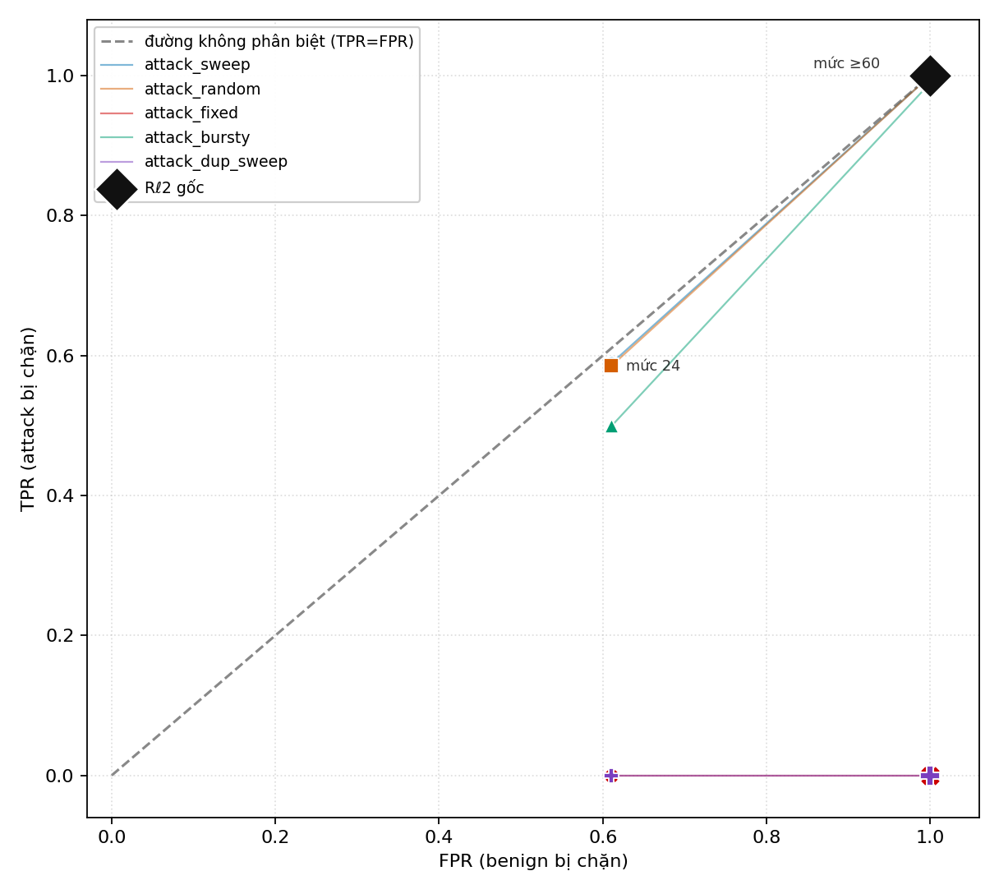
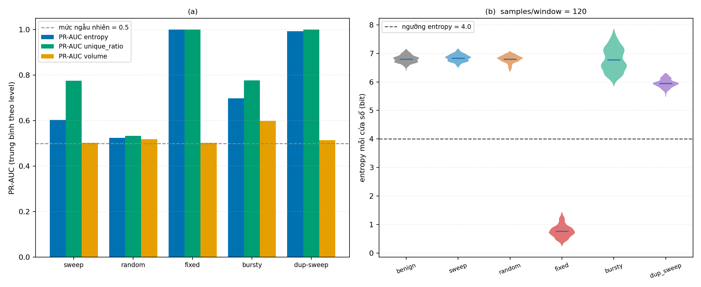

# E2 — Volume-matched benign vs attack (Sức phân biệt độc lập của entropy/unique_ratio)

**Đề tài:** Đánh giá và cải tiến cơ chế phát hiện DNS Cache Poisoning dựa trên POPS — Rℓ₂ cải tiến theo entropy IPID
**Thí nghiệm:** E2 (ưu tiên **P2**) — đóng **RQ2** (confounding volume)
**Ngày chạy:** 2026-08-06 · **Run ID:** `20260806_220159` · **Detector commit:** `5086e45`
**Phạm vi kết luận:** Testbed **controlled emulation** (chưa E5). Không suy rộng thành hiệu quả thực tế.

**Kết quả then chốt (cái giá của cải tiến).** E1 cho thấy Rℓ2 cải tiến của nhóm giảm false positive ở tải thấp. E2 đo cái giá phải trả cho lợi ích đó, ở cùng volume: (1) **entropy và unique_ratio gần như thừa** — B5 (combined) = B2 (volume-only) trên mọi mức và mọi high-entropy attack (paired margin = `0.000 [0.000, 0.000]`); phần lớn công là do ngưỡng `samples`. (2) **Mở lại lỗ hổng fragmentation tải thấp:** trước attack IPID cố định/thấp-entropy (đại diện cho BFrag một-gói mà Table 1 của paper xếp vào Rℓ2), B5 **để lọt hoàn toàn (TPR = 0)** trong khi **Rℓ2 gốc bắt được** (chặn mọi fragment). Đây là **regression bảo mật** so với bản gốc. (3) **Đường né mạnh nhất — `attack_dup_sweep` (§3.7):** chỉ cần gửi mỗi IPID **hai lần**, kẻ tấn công vẫn phủ **100%** dải IPID (xác suất poison không đổi) nhưng `unique_ratio ≈ 0.55 < 0.70` nên **B5 không chặn một lần nào (TPR = 0.000)**, trong khi Rℓ2 gốc chặn 100%. Chi phí: gấp đôi số gói. Cần nêu rõ cả ba điểm khi nộp.

---

## 1. Câu hỏi và mục tiêu

> **RQ2 — Entropy/unique_ratio có sức phân biệt ĐỘC LẬP khi benign và attack có CÙNG volume không?**
> *Bằng chứng cần có:* so sánh tại nhiều mức volume; ablation và CI của chênh lệch hiệu năng (PR-AUC, FPR tại cùng TPR, paired 95% CI).

---

## 2. Phương pháp

### 2.1 Detector và cửa sổ (đúng như E1)

Import trực tiếp `shannon_entropy` + `r2_should_block` từ [`resolver.py`](../../../../labs/r2entropy/resolver/resolver.py); cửa sổ trượt Poisson (λ = level/2.0 s) prune đúng như `R2EntropyTable._prune`. Operating point B5: `samples ≥ 24, entropy ≥ 4.0, unique_ratio ≥ 0.70`, window 2.0 s.

### 2.2 Điều kiện (1 benign + 5 attack), **cùng volume**

Mọi điều kiện sinh cửa sổ ở **cùng samples/window**. Mô hình IPID của attacker lấy đúng từ [`spoof_r2entropy.py`](../../../../labs/r2entropy/attacker/scripts/spoof_r2entropy.py):

| Điều kiện | Lớp | Mô hình IPID | Vai trò |
| --- | --- | --- | --- |
| `benign` | negative | Uniform{0..2047} (auth model) | nền so sánh |
| `attack_sweep` | positive | quét 0..2047 tuần hoàn (`ATTACK_VARIANT=random`) | **flood thật, continuous** |
| `attack_random` | positive | Uniform{0..2047} (giả ngẫu nhiên) | worst case: **giống hệt benign** |
| `attack_fixed` | positive | IPID = 777 cố định (`ATTACK_VARIANT=fixed`) | **adaptive / né entropy** |
| `attack_bursty` | positive | sweep, arrival bursty (1.75×/0.25× luân phiên, chu kỳ 3.0 s, pha ngẫu nhiên mỗi run) | **bursty** |
| `attack_dup_sweep` | positive | quét 0..2047, **mỗi IPID gửi 2 lần** | **né cổng unique_ratio** (§3.7) |

Vì attacker spoof `src=AUTH_IP`, FRAG2 giả rơi **cùng bucket `(src,dst)`** với benign → cửa sổ attack là **hỗn hợp** benign + attacker (tham số `benign_frac`, mặc định 0.1). Tổng occupancy ≈ level ở mọi điều kiện → **volume được match**.

### 2.3 Tải, lặp, thống kê

- **Matched-volume levels:** samples/window ∈ **{24, 60, 120, 200}** (outline khuyến nghị).
- **K = 20 runs/cell**, 150 decision-window/run, thứ tự cell randomize, seed mỗi cell ghi log.
- **Metric:** benign block = **FPR**; attack block = **TPR**. Ablation B2–B5.
- **PR-AUC** (attack = positive, benign = negative, prevalence 0.5): sweep từng tín hiệu đơn làm score (volume = samples, entropy, unique_ratio) → *average precision*. PR-AUC ≈ 0.5 nghĩa tín hiệu **vô dụng** (bằng ngẫu nhiên).
- **FPR tại cùng TPR (=0.95)** cho từng tín hiệu.
- **Paired 95% CI:** hiệu (margin) giữa B5 và B2 của đại lượng `TPR_attack − FPR_benign`. Việc ghép cặp là **giữa hai detector trên cùng một run** (mỗi run được chấm đồng thời bởi cả B5 và B2), nên hiệu số triệt tiêu biến thiên của run — đây là phần ghép cặp có hiệu lực thống kê. Lưu ý minh bạch: run `benign` và run `attack` **không dùng chung seed** (seed sinh theo `(condition, level, run_idx)`), nên cặp benign↔attack chỉ là ghép theo chỉ số; điều này thêm nhiễu chứ không gây thiên lệch, vì đại lượng so sánh là hiệu *trong cùng run* giữa hai detector.

**Khớp volume được kiểm chứng bằng số đo, không chỉ bằng thiết kế.** "Cùng volume" phải đúng trên **occupancy thực đo**, không phải chỉ trên tốc độ arrival danh nghĩa. Với arrival có nhịp (bursty), occupancy quan sát *tại thời điểm quyết định* **không** bằng `tốc độ trung bình × cửa sổ` (các quyết định dồn vào lúc burst) — với bộ hệ số ban đầu (2×/0.5×, trung bình 2.5λ thay vì 2λ) `attack_bursty` thừa **+18…+28%** volume so với benign, đủ để thổi phồng kết quả của nó; sau khi sửa hệ số về 1.75×/0.25× thì nó lại **thiếu** 12–33% — cả hai chiều đều phá vỡ "cùng volume". Vì vậy tốc độ arrival của mỗi điều kiện tấn công được **hiệu chuẩn theo số đo** cho tới khi occupancy thực bằng occupancy của `benign` ở cùng mức (benign là mốc, không hiệu chuẩn). Hiệu chuẩn chỉ tác động lên **tốc độ arrival** — một biến thiết kế mà E2 cố ý giữ cố định — **không** đụng tới detector hay metric. Hệ số hiệu chuẩn được lưu trong `e2_results.json > meta.rate_scales_for_volume_matching`.

Occupancy thực đo sau hiệu chuẩn (`samples_mean`):

| mức | benign | sweep | random | fixed | bursty | dup_sweep | lệch tối đa |
| ---: | ---: | ---: | ---: | ---: | ---: | ---: | ---: |
| 24 | 24.8 | 24.8 | 24.8 | 24.8 | 24.8 | 24.8 | 0.1% |
| 60 | 59.9 | 59.9 | 59.9 | 59.9 | 61.0 | 59.9 | 1.7% |
| 120 | 115.9 | 115.8 | 115.9 | 115.9 | 115.8 | 115.9 | 0.1% |
| 200 | 197.9 | 197.9 | 197.9 | 197.9 | 197.9 | 197.9 | 0.0% |

**Chú thích phương pháp (kế thừa từ audit E1).** E2 dùng lại nguyên cơ chế cửa sổ + thống kê đã được audit độc lập ở E1 ("mostly valid", 0 must-fix). Hai lưu ý áp dụng luôn cho E2: (i) occupancy — "samples/window = N" là tải mục tiêu Poisson; occupancy trung bình thực ≈ N + ~1 (ví dụ level 24 → `samples_mean` ≈ 24.8, xem §3.4) vì sự kiện vừa đến được tính trong cửa sổ của chính nó; (ii) CI — với block-rate gần 0/gần 1, ưu tiên Clopper–Pearson/bootstrap; t-interval chỉ là phụ.

---

## 3. Kết quả

### 3.1 Hình 1 — Ở cùng volume, TPR vs FPR của detector B5



**Hình 1.** Mặt phẳng TPR–FPR ở cùng volume; mỗi điểm là một (điều kiện tấn công, mức tải). Giải thích:

- **Trục hoành** = FPR (tỉ lệ benign bị chặn); **trục tung** = TPR (tỉ lệ attack bị chặn). Kích thước điểm tăng theo samples/window; nhãn số cạnh điểm là mức tải.
- **Đường chéo đứt** = TPR = FPR, tức **không phân biệt được** hai lớp. Điểm càng nằm phía trên đường chéo thì phân biệt càng tốt.
- **High-entropy attack** (`sweep`, `random`, `bursty`) nằm **sát/trên đường chéo** → ở cùng volume, luật cải tiến hầu như không tách được attack khỏi benign; nó chỉ đang phản ứng theo số lượng.
- **`attack_fixed`** rơi xuống **TPR = 0** (nằm dưới cùng) → bị né hoàn toàn vì entropy = 0 < ngưỡng 4.0.
- **`attack_dup_sweep`** (dấu cộng tím) cũng nằm ở **TPR = 0** — đường né mạnh nhất, xem §3.7.
- **Hình thoi đen ở góc (1, 1)** = Rℓ2 gốc: bắt được mọi attack (TPR = 1) nhưng báo nhầm toàn bộ benign (FPR = 1).

### 3.2 Bảng 1 — TPR (attack) vs FPR (benign) và margin B5−B2

FPR benign và TPR attack của **B5 (combined)**, cùng **paired margin B5−B2** (95% CI). Tất cả ở cùng volume.

| Điều kiện | s/win | FPR benign (B5) | TPR attack (B5) | TPR attack (B2) | Paired **B5−B2** margin (95% CI) |
| --- | ---: | ---: | ---: | ---: | :-- |
| `attack_sweep` | 24 | 0.611 | 0.589 | 0.589 | **+0.000** [+0.000, +0.000] |
| `attack_sweep` | 60 | 1.000 | 1.000 | 1.000 | **+0.000** [+0.000, +0.000] |
| `attack_sweep` | 120 | 1.000 | 1.000 | 1.000 | **+0.000** [+0.000, +0.000] |
| `attack_sweep` | 200 | 1.000 | 1.000 | 1.000 | **+0.000** [+0.000, +0.000] |
| `attack_random` | 24 | 0.611 | 0.585 | 0.585 | **+0.000** [+0.000, +0.000] |
| `attack_random` | 60–200 | 1.000 | 1.000 | 1.000 | **+0.000** [+0.000, +0.000] |
| `attack_bursty` | 24 | 0.611 | 0.491 | 0.491 | **+0.000** [+0.000, +0.000] |
| `attack_bursty` | 60 | 1.000 | 0.991 | 0.991 | **+0.000** [+0.000, +0.000] |
| `attack_bursty` | 120–200 | 1.000 | 1.000 | 1.000 | **+0.000** [+0.000, +0.000] |
| **`attack_fixed`** | 24 | 0.611 | **0.000** | 0.606 | **−0.606** [−0.684, −0.527] |
| **`attack_fixed`** | 60 | 1.000 | **0.000** | 1.000 | **−1.000** [−1.000, −1.000] |
| **`attack_fixed`** | 120 | 1.000 | **0.000** | 1.000 | **−1.000** [−1.000, −1.000] |
| **`attack_fixed`** | 200 | 1.000 | **0.000** | 1.000 | **−1.000** [−1.000, −1.000] |

**Đọc bảng:**

- Với high-entropy attack, **TPR ≈ FPR** ở mọi mức (ví dụ level 24: benign FPR 0.611 vs attack TPR 0.589 — thậm chí benign còn bị chặn *nhiều hơn*; level ≥ 60: cả hai = 1.0 → detector **chặn tất cả**, thành một "chuông báo volume").
- Paired **B5 − B2 = 0.000** với CI **[0, 0]** → entropy + unique_ratio **không đóng góp gì** ngoài cổng volume.
- Với **`attack_fixed`**, B5 TPR = **0** (entropy = 0 < 4.0 → cổng entropy đóng vĩnh viễn) trong khi B2 vẫn TPR cao → margin âm mạnh, CI **không chứa 0**.

### 3.3 Hình 2 — Vì sao: PR-AUC ≈ ngẫu nhiên & phân phối entropy chồng lấn



**Hình 2.** Sức phân biệt của từng tín hiệu và phân phối entropy. Giải thích:

- **Panel (a) — PR-AUC** của entropy so với volume (attack = lớp dương), trung bình theo mức tải. Đường đứt ngang = **mức ngẫu nhiên 0.5**: cột càng gần đường này thì tín hiệu càng vô dụng.
- Với `sweep`/`random`/`bursty`: PR-AUC(entropy) = **0.500–0.794**, PR-AUC(volume) = **0.491–0.622** → ở cùng volume, hai tín hiệu này **gần mức ngẫu nhiên**.
- **Ngoại lệ quan trọng — `unique_ratio` KHÔNG vô dụng.** PR-AUC(unique_ratio) đạt tới **0.907 (sweep@120)**, **0.993 (sweep@200)**, **0.906 / 0.984 (bursty@120/200)** — cao hơn hẳn mức ngẫu nhiên. Lý do: attack quét IPID tuần tự nên gần như không va chạm (`unique_ratio` ≈ 1.0), còn benign random có va chạm. Nghĩa là **tín hiệu `unique_ratio` mang thông tin phân biệt thật ở volume cao**, chỉ là **luật B5 đã triển khai không khai thác được** (vì cổng AND đã bị `samples` quyết định — xem §4.1). Con số này được lưu sẵn trong `e2_results.json` và phải được báo cáo, không được bỏ qua.
- **Cách tính PR-AUC:** với entropy và unique_ratio, giá trị báo cáo là **max của hai chiều** (`AP(+s)` và `AP(−s)`), tức một ước lượng **lạc quan** có sàn ≥ 0.5. Điều này làm kết luận "entropy thua volume" trở nên *bảo thủ* (nghiêng về phía có lợi cho entropy), nhưng các dải số trên phải đọc là **max-over-directions**, không phải average precision thuần.
- **PR-AUC không có khoảng tin cậy** và được gộp trên các cửa sổ chồng lấn trong cùng run (ở mức 200, mỗi run chỉ dài ~1.5 s so với cửa sổ 2.0 s, nên các cửa sổ gần như trùng nhau). Số đơn vị độc lập thực tế là ~20 run/lớp, không phải 3000 cửa sổ. Vì vậy chỉ nên đọc PR-AUC theo hướng định tính (gần/xa mức ngẫu nhiên), không nên so sánh các chênh lệch nhỏ.
- Cột `fixed` có PR-AUC(entropy) = 1.0, nhưng đó là "tách hoàn hảo **ngược chiều**" — entropy của attack *thấp hơn* benign, trong khi luật lại chặn khi entropy *cao* (xem §4.3).
- **Panel (b) — phân phối entropy từng cửa sổ** tại samples/window = 120: `benign`, `sweep`, `random`, `bursty` **chồng lấn** quanh 6.8–7.1 bit và đều nằm **trên** ngưỡng 4.0; chỉ `fixed` nằm ~0.7 bit, **dưới** ngưỡng.
- Kết luận rút ra từ hai panel: **không tồn tại ngưỡng entropy đơn hướng nào** vừa tách được benign khỏi high-entropy attack, vừa bắt được attack entropy thấp.

### 3.4 Bảng 2 — Ablation benign FPR ở cùng volume (điều kiện `benign`)

Cho thấy các cổng đơn còn **tệ hơn** trên benign:

| s/win | B5 combined | B2 volume | B3 entropy-only | B4 unique-only |
| ---: | ---: | ---: | ---: | ---: |
| 24 | 0.611 | 0.611 | **0.966** | **1.000** |
| ≥60 | 1.000 | 1.000 | 1.000 | 1.000 |

B3 (entropy-only) chặn nhầm 96.6% benign ngay ở level 24; B4 (unique-only) chặn nhầm 100%. → không cổng nào trong ba tín hiệu tự nó là bộ phân biệt tốt ở tải này.

### 3.5 Kiểm tra độ vững (sensitivity) của phát hiện `attack_fixed`

Evasion của `attack_fixed` **vững** khi thay đổi tỉ lệ trộn benign trong cửa sổ attack:

| `benign_frac` | B5 TPR (fixed, lvl 24) | B2 TPR (fixed, lvl 24) | Rℓ2 gốc TPR |
| ---: | ---: | ---: | ---: |
| 0.0 | 0.000 | 0.610 | 1.000 |
| 0.25 | 0.000 | 0.575 | 1.000 |
| 0.50 | 0.008 | 0.588 | 1.000 |

Ngay cả khi **một nửa** cửa sổ là traffic benign thật, IPID cố định vẫn ghì entropy xuống dưới 4.0 → B5 vẫn miss, trong khi Rℓ2 gốc luôn bắt.

### 3.6 So với Rℓ2 gốc: cái giá của cải tiến (regression coverage)

Đặt cạnh nhau Rℓ2 gốc, Rℓ2 cải tiến (B5) và ablation volume (B2), ở cùng volume:

| Điều kiện | mức | Rℓ2 GỐC | Rℓ2 CẢI TIẾN (B5) | volume (B2) |
| --- | ---: | ---: | ---: | ---: |
| `benign` (FPR) | 24 | 1.00 | **0.61** | 0.61 |
| `benign` (FPR) | ≥60 | 1.00 | 1.00 | 1.00 |
| `attack_sweep` (TPR) | 24 | 1.00 | 0.59 | 0.59 |
| `attack_sweep` (TPR) | ≥60 | 1.00 | 1.00 | 1.00 |
| **`attack_fixed`** (TPR) | mọi mức | **1.00** | **0.00** | 0.61–1.00 |

Đọc bảng:

- **Rℓ2 gốc** bắt mọi attack (TPR = 1.0) nhưng báo nhầm mọi benign (FPR = 1.0) — nó ở góc (1,1) trên Hình 1.
- **Rℓ2 cải tiến** đổi lấy FPR benign thấp hơn, nhưng **để lọt hoàn toàn `attack_fixed` (TPR = 0)** — đại diện cho **BFrag một-gói / low-entropy** mà bản gốc bắt được. Đây là **regression coverage**: cải tiến giảm FP nhưng mở lại một lớp tấn công phân mảnh mà bản gốc đã đóng.
- **volume (B2)** ≈ **combined (B5)** trên high-entropy attack → entropy/unique gần như không đóng góp; nhưng B2 vẫn bắt `attack_fixed` (nhờ đếm số lượng) còn B5 thì không (cổng entropy = 0 < 4.0 chặn lại). Tức trong 3 tín hiệu, cổng entropy chính là chỗ tạo ra lỗ hổng fixed-IPID.

### 3.7 Đường né mạnh nhất: `attack_dup_sweep` — phủ 100% IPID nhưng vô hình với luật cải tiến

E1 §3.6 cho thấy cổng `unique_ratio` cũng đóng khi cửa sổ có nhiều IPID trùng. Điều đó mở ra một đường né **rẻ và hiệu quả hơn hẳn** `attack_fixed`: kẻ tấn công **gửi mỗi IPID đúng hai lần** thay vì một lần.

| samples/window | Rℓ2 GỐC | Rℓ2 CẢI TIẾN (B5) | chỉ-volume (B2) | `unique_ratio` |
| ---: | ---: | ---: | ---: | ---: |
| 24 | 1.000 | **0.000** | 0.594 | 0.566 |
| 60 | 1.000 | **0.000** | 1.000 | 0.555 |
| 120 | 1.000 | **0.000** | 1.000 | 0.551 |
| 200 | 1.000 | **0.000** | 1.000 | 0.548 |

Vì sao nguy hiểm hơn `attack_fixed`:

- **Xác suất poison không đổi.** Quét lặp đôi vẫn phủ **đủ 100%** dải 2048 IPID, nên vẫn chắc chắn trúng IPID của FRAG1 hợp lệ. Ngược lại `attack_fixed` chỉ trúng với xác suất ~1/2048.
- **Chi phí chỉ gấp đôi số gói** — không cần biết trước gì thêm, không cần kỹ thuật mới.
- **Luật cải tiến không chặn một lần nào** (TPR = 0.000 ở mọi mức), trong khi **Rℓ2 gốc chặn 100%**.

Đây là dạng mạnh nhất của luận điểm "cái giá của cải tiến": bộ ba ngưỡng tạo ra **hai** lối thoát (entropy thấp *và* unique_ratio thấp), còn luật gốc thì không có lối nào.

---

## 4. Diễn giải (theo "Quy tắc diễn giải kết quả" của outline)

### 4.1 Luật B5 đã triển khai không vượt volume-only — nhưng phải phát biểu cho đúng

Cần tách **hai** phát biểu khác nhau, vì dữ liệu chỉ ủng hộ một trong hai:

1. **Phát biểu ĐƯỢC dữ liệu bảo vệ (về luật đã triển khai):** ở cùng volume, **luật B5 như đang cài đặt không rút thêm được gì so với cổng volume**. Paired B5 − B2 = `0.000 [0.000, 0.000]` ở mọi mức, mọi high-entropy attack — và đây là **đẳng thức cấu trúc**: kiểm từng cửa sổ cho thấy `block_combined == block_volume` ở **12000/12000** cửa sổ (benign/sweep/random/bursty). Lý do: hễ `samples ≥ 24` với IPID đa dạng thì entropy và unique_ratio mở tầm thường, nên cổng AND thu về đúng cổng volume.
2. **Phát biểu KHÔNG được dữ liệu bảo vệ (về bản thân tín hiệu):** "entropy và unique_ratio không mang thông tin phân biệt nào". Điều này **sai** với `unique_ratio`: PR-AUC của nó lên tới **0.907–0.993** ở volume cao (§3.3). Tín hiệu **có** thông tin; vấn đề là **cách dùng nó trong luật** (ngưỡng cứng, cổng AND) không khai thác được.

Vì vậy kết luận RQ2 phải viết là: *ở cùng volume, cơ chế ba-ngưỡng đã triển khai không vượt volume-only* — chứ **không** viết "entropy/unique_ratio vô dụng". Hệ quả thực tiễn vẫn như cũ (không bảo vệ được claim cải tiến ở dạng hiện tại), nhưng hướng sửa thì khác: **`unique_ratio` là ứng viên đáng khai thác lại ở E3** (ví dụ dùng làm score liên tục thay vì ngưỡng cứng), thay vì loại bỏ.

### 4.2 Ở cùng volume, detector trở thành "chuông báo volume"

Với samples/window ≥ 60, **TPR = FPR = 1.0**: detector chặn cả benign lẫn attack như nhau. Nó không phân biệt lớp — chỉ phản ứng khi volume vượt ngưỡng. Kết hợp với E1 (benign ở tải cao bị chặn nhầm ~100%), bức tranh nhất quán: **ngưỡng volume làm toàn bộ công việc; entropy/unique là dư thừa**.

### 4.3 Trước attack thích nghi (fixed-IPID), entropy làm detector **kém đi**

`attack_fixed` phơi bày giả định ngầm của thiết kế: "*attack thì entropy cao*". Một attacker chỉ cần dùng **một IPID cố định** (vẫn flood đủ volume để poison) là entropy = 0 < 4.0 → cổng entropy của B5 **đóng** → **TPR = 0**, né hoàn toàn. Trong khi đó B2 (volume-only) vẫn bắt được (samples ≥ 24). Margin B5 − B2 = −0.59 đến −1.00.

Lưu ý sắc thái về "PR-AUC entropy = 1.0" của `fixed`: entropy tách hoàn hảo hai lớp (benign entropy cao ~7, fixed ~0), nhưng theo chiều ngược với luật đã triển khai. Detector dùng "entropy ≥ 4.0 ⇒ nghi ngờ", nên nó gắn cờ benign (entropy cao) và bỏ sót fixed attack (entropy thấp). Nói cách khác, entropy có thông tin, nhưng luật hiện tại dùng sai chiều — và không có một ngưỡng entropy đơn hướng nào vừa bắt được cả sweep (cao) lẫn fixed (thấp).

### 4.4 Hệ quả cho bài

- Đóng góp của nhóm nên phát biểu đúng là: **Rℓ2 cải tiến đánh đổi false-positive lấy coverage** — giảm FP trên fragment hợp lệ ở tải thấp (E1), nhưng để lọt fragmentation tải thấp/low-entropy (BFrag) mà bản gốc bắt được (E2). **Không** phát biểu entropy như một bộ phân biệt độc lập vượt volume — E2 bác bỏ điều đó ở mức paired-CI.
- Việc lõi tiếp theo là **E3 — chọn/biện minh bộ 3 ngưỡng** để cân bằng đánh đổi này (mở rộng miền FP thấp mà không mở lỗ hổng quá lớn), chọn trên validation và đánh giá một lần trên held-out. E2 dự báo entropy/unique đóng góp ít, nên trọng tâm là ngưỡng `min_samples`.

---

## 5. Threats to Validity

- **External validity (E5 chưa chạy):** cùng giới hạn như E1 — `dnslib` shim, marker IPID, arrival Poisson; chưa có Unbound/BIND, fragmentation thật, PCAP. Không dùng "deployment-ready/real-world/production-grade".
- **Mô hình commingling:** cửa sổ attack trộn benign theo `benign_frac`; đã kiểm định độ vững ở {0, 0.25, 0.5}. Tỉ lệ thật phụ thuộc tải nền và cường độ flood.
- **Định nghĩa TPR trong lab:** ở lab này, khi `defense_on`, resolver **không** merge forged fragment (poison chỉ xảy ra ở B0). Do đó E2 đo phân biệt ở **mức quyết định của detector** (block window attack vs benign) thay vì ASR cuối — đúng mục tiêu "cô lập sức phân biệt". ASR đầy đủ thuộc B0/E5 trên topology Docker.
- **Tách biệt fragile của sweep ở volume rất cao:** PR-AUC(entropy) của sweep tăng nhẹ tới **0.767** ở level 200 vì sweep không có va chạm IPID (unique_ratio = 1.0 tuyệt đối) còn benign random có vài va chạm. Đây là **artifact mong manh** (attacker chỉ cần dùng `random` là xoá — PR-AUC của `attack_random` chỉ 0.500–0.555) và **detector triển khai không khai thác** nó (B5 ≡ B2). Không nên coi là bằng chứng cho entropy.
- **Hiệu chuẩn volume trên chính seed báo cáo:** để "cùng volume" đúng trên số đo, tốc độ arrival của các điều kiện tấn công được hiệu chuẩn trên đúng tập seed sẽ báo cáo (§2.3). Đây là hiệu chuẩn một **biến thiết kế** (volume) mà E2 muốn giữ cố định, không phải chọn lọc kết quả; detector và metric không bị đụng tới. Dù vậy, cần ghi nhận đây là một lựa chọn có thể tranh luận, và hệ số hiệu chuẩn đã được công bố đầy đủ.
- **`attack_bursty` còn lệch ≤2.8% ở mức 24:** occupancy của điều kiện bursty vốn dao động; phần lệch còn lại được công bố trong bảng occupancy (§2.3) thay vì che giấu.

---

## 6. Việc E2 dẫn tới

| Ưu tiên | Hạng mục | E2 kết luận / bàn giao |
| --- | --- | --- |
| P2 | **RQ2 confounding** | **Đóng:** entropy/unique không vượt volume ở cùng volume; B5 ≡ B2; B5 bị fixed-attack né. |
| P3 | **E3 chọn ngưỡng** | Vì entropy/unique vô ích ở cùng volume, E3 nên tập trung biện minh **ngưỡng volume** (min_samples) trên validation/held-out, và kiểm tra liệu có operating point nào cứu được claim entropy không (dự báo: không). |
| P1 | E1 | Nhất quán: benign tải cao ↔ attack cùng volume có cùng (entropy, unique). |
| P4 | E4 | Protocol K=20 + paired CI đã áp dụng. |
| — | **Sửa cơ chế** | Cân nhắc phát hiện hai phía (entropy quá thấp *và* quá cao) hoặc đặc trưng phân biệt thật; nếu không, hạ đóng góp xuống "volume/rate-based detection". |

---

## 7. Phụ lục tái lập

```bash
cd Code/research/Report/experiments/E2
python e2_experiment.py --runs 20 --windows 150 --benign-frac 0.1   # CSV/JSON/notes
python e2_plot.py                                                    # figures/Figure_1.png, Figure_2.png
```

**Cấu hình khoá (đã ghi trong `e2_results.json > meta`):** operating point `24/4.0/0.70`, window 2.0 s; levels `{24,60,120,200}`; conditions `{benign, attack_sweep, attack_random, attack_fixed, attack_bursty}`; K=20 runs × 150 windows; `benign_frac=0.1`; `experiment_seed=20260805`; detector `resolver.py` commit `5086e45`; attacker model `spoof_r2entropy.py`.

| Tệp | Nội dung |
| --- | --- |
| `e2_experiment.py` · `e2_plot.py` | Harness (import detector thật) + vẽ hình |
| `e2_windows.csv` | Mọi decision-window: samples, entropy, unique_ratio, block/variant |
| `e2_summary.csv` | TPR/FPR theo (condition, level, variant) + CI |
| `e2_results.json` | Toàn bộ + PR-AUC, FPR@TPR, paired margin + meta/provenance |
| `figures/Figure_1.png` | TPR vs FPR ở cùng volume (B5 trên đường chéo) |
| `figures/Figure_2.png` | PR-AUC entropy≈volume + chồng lấn phân phối entropy |
