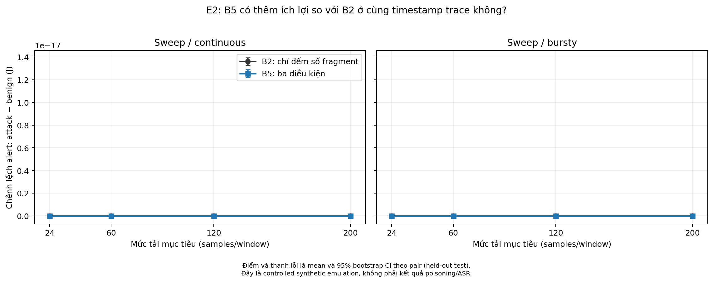

# E2 — Đánh giá giá trị bổ sung của entropy và tỷ lệ IPID khác nhau trong Rℓ2 cải tiến

**Run ID:** `E2_confirmatory_20260813_165220_seed20260813`  
**Trạng thái kiểm tra:** `PASS`  
**Phạm vi:** mô phỏng có kiểm soát theo thời điểm query. Đây không phải thí nghiệm IP fragment thật; không đo poisoning, ASR, độ trễ, CPU hay hiệu năng triển khai.

## Mục tiêu

B2 chỉ nhìn vào **số fragment** trong 2 giây. B5 chỉ bật khi đồng thời đủ số fragment, entropy cao và tỉ lệ IPID khác nhau cao. E2 hỏi rất đơn giản: nếu benign và condition stress có đúng cùng lịch timestamp, hai dấu hiệu entropy/unique ratio có giúp B5 phân biệt tốt hơn B2 không?

## Thiết kế volume-matched benign vs attack

- Có 20 lần chạy độc lập cho mỗi ô kết quả chính (test), mỗi lần 150 lần chấm điểm.
- Mỗi benign/attack pair dùng chung hoàn toàn thời điểm FRAG2 và thời điểm query. Vì vậy số mẫu trong từng cửa sổ là như nhau; khác biệt nếu có chỉ đến từ IPID/origin chứ không phải tải.
- Trước test có một split kiểm tra generator và một split validation riêng. Test không được dùng để chọn ngưỡng hay chỉnh tốc độ.
- Mỗi run giữ raw JSONL: event FRAG2, IPID, origin, timestamp, feature và các quyết định của biến thể rule. Validator đã đọc lại toàn bộ raw và tính lại các số trong bảng.
- Hai mẫu so sánh chính là sweep IPID liên tục và sweep IPID theo đợt; IPID random là đối chứng. Fixed và duplicate là failure probe độ đa dạng IPID thấp, không phải kết quả poisoning/ASR.
- Chưa có biến thể adaptive/high-entropy; không suy diễn kết quả thành khả năng né detector của đối thủ thật.

## Cách đọc số

- **Benign bị bật**: rule bật trên traffic benign control. Số thấp hơn là tốt hơn về mặt tránh TC/TCP không cần thiết.
- **Condition attack bị bật**: rule bật trong condition stress tổng hợp. Đây chỉ là detector alert rate, **không phải** tỉ lệ ngăn poisoning thành công.
- **J** = condition attack bị bật − benign bị bật. J càng cao thì rule càng tách được hai condition trong mô phỏng này.
- **ΔJ (B5−B2)** dương nghĩa là B5 tách tốt hơn B2; âm nghĩa là kém hơn. Khoảng 95% cho biết độ dao động giữa các run pair.
- E2 không báo cáo FPR tại cùng TPR cho B2/B5 vì hai luật dùng ngưỡng đã khóa; AUPRC dưới đây là phân tích score-level riêng.

## Kết quả: volume-matched benign vs attack

### Sweep IPID liên tục

ΔJ trung bình = +0.000, CI 95% [+0.000, +0.000]. Trong dữ liệu này, B5 và B2 gần như tương đương trong biên ±0,05 đã đăng ký trước.

| Tải | B2: benign bị bật | B2: condition attack bị bật | B5: benign bị bật | B5: condition attack bị bật | ΔJ (B5−B2), 95% CI |
|---:|---:|---:|---:|---:|---:|
| 24 | 0.510 | 0.510 | 0.510 | 0.510 | 0.000 [0.000, 0.000] |
| 60 | 1.000 | 1.000 | 1.000 | 1.000 | 0.000 [0.000, 0.000] |
| 120 | 1.000 | 1.000 | 1.000 | 1.000 | 0.000 [0.000, 0.000] |
| 200 | 1.000 | 1.000 | 1.000 | 1.000 | 0.000 [0.000, 0.000] |

### Sweep IPID theo đợt

ΔJ trung bình = +0.000, CI 95% [+0.000, +0.000]. Trong dữ liệu này, B5 và B2 gần như tương đương trong biên ±0,05 đã đăng ký trước.

| Tải | B2: benign bị bật | B2: condition attack bị bật | B5: benign bị bật | B5: condition attack bị bật | ΔJ (B5−B2), 95% CI |
|---:|---:|---:|---:|---:|---:|
| 24 | 0.494 | 0.494 | 0.494 | 0.494 | 0.000 [0.000, 0.000] |
| 60 | 0.999 | 0.999 | 0.999 | 0.999 | 0.000 [0.000, 0.000] |
| 120 | 1.000 | 1.000 | 1.000 | 1.000 | 0.000 [0.000, 0.000] |
| 200 | 1.000 | 1.000 | 1.000 | 1.000 | 0.000 [0.000, 0.000] |

### Kết quả âm: IPID cố định và IPID lặp

- `attack_random_continuous` là negative control: IPID random có thể giống benign về phân phối.
- `attack_fixed_continuous` và `attack_dup_sweep_continuous` là failure probe của detector: chúng chỉ cho biết rule bật hay không trong dòng IPID tổng hợp. Không được suy ra ASR, BFrag coverage hay poisoning success.

| Tải | B2 bật ở fixed/duplicate | B5 bật ở fixed/duplicate | ΔJ fixed, 95% CI | ΔJ duplicate, 95% CI |
|---:|---:|---:|---:|---:|
| 24 | 0.510 | 0.000 | -0.510 [-0.545, -0.470] | -0.510 [-0.545, -0.472] |
| 60 | 1.000 | 0.000 | -1.000 [-1.000, -1.000] | -1.000 [-1.000, -1.000] |
| 120 | 1.000 | 0.000 | -1.000 [-1.000, -1.000] | -1.000 [-1.000, -1.000] |
| 200 | 1.000 | 0.000 | -1.000 [-1.000, -1.000] | -1.000 [-1.000, -1.000] |

Trong hai probe này B5 không bật, còn B2 vẫn bật. Đây là kết quả âm quan trọng: B5 có thể kém B2 rõ rệt về detector alert separation khi entropy/unique ratio không qua ngưỡng.

### Phân tích bổ sung: PR-AUC/AUPRC của tín hiệu liên tục

| Tải | Volume | Entropy | Tỷ lệ IPID khác nhau |
|---:|---:|---:|---:|
| 24 | 0.500 | 0.514 | 0.530 |
| 60 | 0.500 | 0.550 | 0.666 |
| 120 | 0.500 | 0.618 | 0.888 |
| 200 | 0.500 | 0.726 | 0.992 |

Ở sweep liên tục tải 200, tỷ lệ IPID khác nhau đạt AUPRC cao trong khi B2/B5 vẫn đồng nhất. Điều này cho thấy tín hiệu có thông tin, nhưng phép AND với ngưỡng cố định hiện tại chưa khai thác được nó.

## Điều E2 chưa thể kết luận

E2 chưa chứng minh rule mới cải thiện hiệu năng hệ thống hoặc vẫn giữ nguyên độ an toàn của POPS Rℓ2. Muốn kết luận như vậy cần E5: IP fragmentation thật, resolver thật, TC→TCP đầy đủ, và đo attack outcome/latency/CPU.

## File để kiểm tra lại

- `e2_protocol.json`: thiết kế đã khóa trước khi chạy.
- `e2_runs.csv`, `e2_decisions.csv.gz`, `raw_runs/`: số liệu gốc theo run/event.
- `e2_results.json`, `e2_summary.csv`: tổng hợp chỉ từ test split.
- `validation.json`: kết quả kiểm tra raw → bảng; phải là PASS trước khi dùng báo cáo này.
