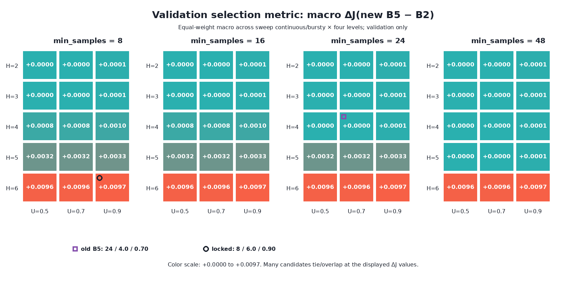
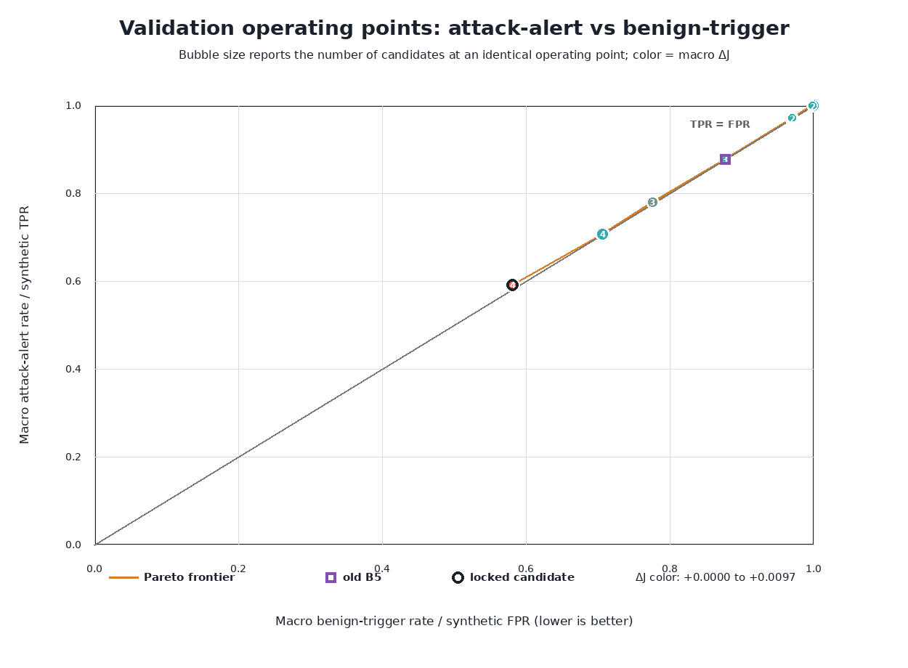
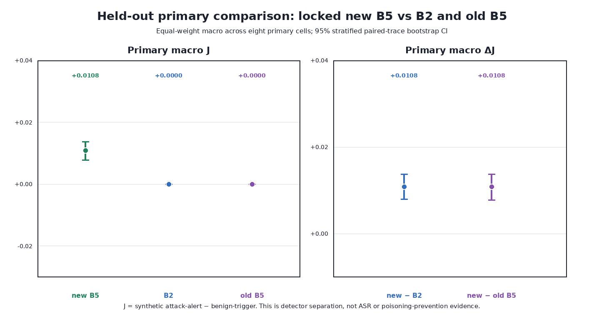
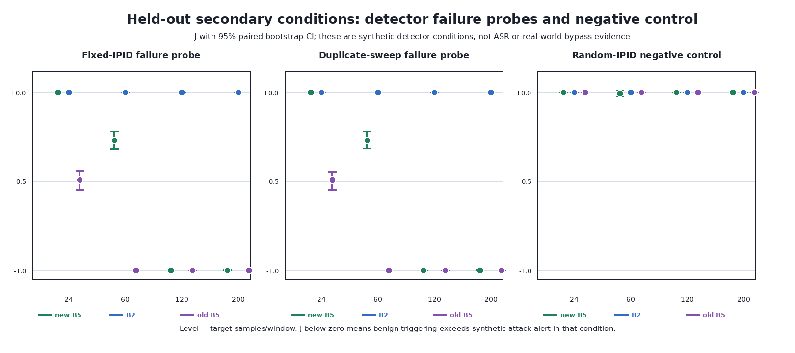

# E3 — Chọn operating point B5 trên validation và đánh giá held-out

## 1. Mục tiêu

E2 cho thấy B5 cũ (`samples ≥ 24`, `entropy ≥ 4.0`, `unique_ratio ≥ 0.70`) không tạo thêm khả năng phân biệt so với B2 chỉ dùng volume trên hai attack sweep chính: cả benign và attack thường cùng bị cảnh báo. E3 trả lời câu hỏi hẹp hơn:

> Trong grid B5 đã đăng ký, có operating point nào tăng độ tách biệt detector so với B2 khi được chọn **chỉ** bằng validation và sau đó kiểm tra một lần trên held-out test không?

Chỉ số chính là:

$$
J = \text{synthetic attack-alert rate} - \text{benign-trigger rate}
$$

và tiêu chí chọn là tối đa hóa $\Delta J=J_{\text{new B5}}-J_{\text{B2}}$, macro-average đồng trọng số trên hai sweep chính (continuous, bursty) × bốn mức volume (24, 60, 120, 200).

`attack-alert rate` và `benign-trigger rate` lần lượt là TPR/FPR **tổng hợp trong mô phỏng detector**. Chúng không phải attack success rate (ASR), cũng không đo DNS poisoning prevention.

## 2. Thiết kế thí nghiệm và khóa threshold

E3 dùng canonical E2 decision dataset, nhưng tạo repartition E3 mới theo paired trace: 60% train/exploration chỉ phục vụ kiểm tra implementation, 20% validation để chọn ngưỡng, và 20% held-out test để xác nhận sau khi khóa. Mọi decision window của một paired trace nằm trong cùng một partition.

| Hạng mục | Thiết kế đã khóa |
| --- | --- |
| Rule candidate | `samples ≥ N AND entropy ≥ H AND unique_ratio ≥ U` |
| Grid | $N\in\{8,16,24,48\}$, $H\in\{2,3,4,5,6\}$, $U\in\{0.5,0.7,0.9\}$: 60 candidate |
| Comparator | B2 = `block_volume`; old B5 = `block_combined` = `24/4.0/0.70` |
| Selection split | Validation, không dùng held-out test |
| Selection criterion | Maximize macro $\Delta J(\text{new B5}-\text{B2})$ trên 8 primary cells |
| Tie-break | Higher $\Delta J$, lower benign-trigger, higher attack-alert, rồi tăng dần $(N,H,U)$ |
| Failure probes / negative control | Report riêng; không phải selection constraint |
| Inference | 5.000 paired-trace bootstrap resamples, CI 95% |

Validation chọn candidate **`N=8, H=6.0, U=0.90`**. Bốn candidate `H=6.0, U=0.90` với `N=8/16/24/48` có cùng metric primary ở độ chính xác artifact; tie-break cuối cùng chọn `N=8`. Không có hard constraint TPR ≥ 0.95 và không có retuning sau khi nhìn test.

Threshold được khóa trong [`e3_locked_threshold.json`](e3_locked_threshold.json) trước khi test. Lock validator đạt `PASS` 9/9; held-out evaluator ghi rõ `evaluation_count = 1` và không sweep hay chọn lại threshold.

## 3. Kết quả validation

*Hình 1. Mỗi panel cố định `min_samples`; mỗi ô là một cặp entropy/unique-ratio. Ô vuông tím là old B5 `24/4.0/0.70`; vòng tròn đen là candidate đã khóa `8/6.0/0.90`.*

**Cách đọc và ý nghĩa Hình 1.**

- Màu nóng hơn nghĩa là macro $\Delta J$ cao hơn trên validation. Old B5 nằm gần vùng $\Delta J=0$, phù hợp với kết quả E2 rằng point cũ không tách benign khỏi attack tốt hơn B2.
- Candidate lock đạt macro $\Delta J=0.00972$ trên validation. Lợi ích chủ yếu đi cùng entropy threshold 6; thay đổi `N` hoặc một số giá trị `U` tạo nhiều điểm bằng nhau hoặc gần như bằng nhau.
- Nhiều candidate có cùng giá trị hiển thị/overlap. Điều này là đặc điểm của dữ liệu quyết định rời rạc và grid, không phải 60 bằng chứng độc lập. Candidate được chọn duy nhất nhờ tie-break đã đăng ký, không nhờ chọn điểm đẹp nhất sau test.

*Hình 2. Trục ngang là macro benign-trigger rate/FPR tổng hợp (thấp hơn tốt hơn); trục dọc là macro attack-alert rate/TPR tổng hợp (cao hơn tốt hơn). Kích thước bubble là số candidate trùng tọa độ; đường cam là Pareto frontier không bị dominated theo hai trục này.*

**Cách đọc và ý nghĩa Hình 2.**

- Đường chéo `TPR = FPR` là mốc không tạo tách biệt: $J=0$. Các operating point nhìn chung nằm rất gần đường này, nên cải thiện có được là nhỏ về mặt tuyệt đối.
- Candidate lock nằm gần $(\text{FPR}=0.5814, \text{TPR}=0.5911)$ trên validation. Nó giảm benign trigger nhiều hơn phần attack alert giảm, từ đó có $\Delta J$ dương.
- Pareto frontier chỉ diễn tả trade-off trên validation; nó **không** thay thế selection criterion đã khóa và không được dùng để chọn lại threshold. Bubble và con số multiplicity cho thấy nhiều threshold cho cùng operating point.

## 4. Kết quả held-out chính

Sau lock gate, E3 đọc 27.600 decision của held-out test đúng một lần. Phân tích chính macro-average tám primary cell; mỗi cell có 6 paired traces. CI dùng bootstrap phân tầng, resample paired trace bên trong từng cell rồi macro-average đồng trọng số.

| Variant / so sánh | Attack-alert | Benign-trigger | FNR | Balanced precision (50:50) | $J$ hoặc $\Delta J$, CI 95% |
| --- | ---: | ---: | ---: | ---: | ---: |
| New B5 `8/6.0/0.90` | 0,5913 | 0,5804 | 0,4088 | 0,5054 | $J=0,0108$ [0,0078; 0,0138] |
| B2 volume-only | 0,8713 | 0,8713 | 0,1288 | 0,5000 | $J=0,0000$ [0,0000; 0,0000] |
| Old B5 `24/4.0/0.70` | 0,8713 | 0,8713 | 0,1288 | 0,5000 | $J=0,0000$ [0,0000; 0,0000] |
| New B5 − B2 | — | — | — | — | $\Delta J=+0,0108$ [+0,0079; +0,0138] |
| New B5 − old B5 | — | — | — | — | $\Delta J=+0,0108$ [+0,0078; +0,0138] |

*Hình 3. Điểm là macro mean trên tám primary cells; thanh lỗi là CI paired bootstrap 95%. Panel trái là $J$ của từng variant; panel phải là $\Delta J$ của new B5 so với B2 và old B5.*

**Cách đọc và ý nghĩa Hình 3.**

- Held-out tái lập hướng cải thiện đã thấy trên validation: CI 95% của cả hai $\Delta J$ đều dương. Theo criterion E3 đã đăng ký, new B5 tốt hơn B2 và old B5 về **synthetic detector separation** trung bình.
- Mức cải thiện tuyệt đối chỉ khoảng 0,011. New B5 đạt điều này bằng cách giảm benign trigger từ 0,8713 xuống 0,5804, nhưng attack alert cũng giảm từ 0,8713 xuống 0,5913; FNR vì vậy tăng từ 0,1288 lên 0,4088.
- Vì vậy không thể diễn giải kết quả là “B5 phát hiện attack tốt hơn”. Kết luận đúng là operating point mới cân bằng hai tỷ lệ tốt hơn một ít theo $J$ trong điều kiện tổng hợp đã chọn.

Kết quả theo từng primary cell cho thấy lợi ích không đồng đều:

| Primary condition | Level | New B5 attack-alert | New B5 benign-trigger | New B5 $J$ | $\Delta J$ vs B2, CI 95% |
| --- | ---: | ---: | ---: | ---: | ---: |
| Sweep continuous | 24 | 0,0000 | 0,0000 | 0,0000 | 0,0000 [0,0000; 0,0000] |
| Sweep continuous | 60 | 0,3167 | 0,2689 | 0,0478 | 0,0478 [0,0267; 0,0678] |
| Sweep continuous | 120 | 1,0000 | 1,0000 | 0,0000 | 0,0000 [0,0000; 0,0000] |
| Sweep continuous | 200 | 1,0000 | 0,9989 | 0,0011 | 0,0011 [0,0000; 0,0033] |
| Sweep bursty | 24 | 0,0000 | 0,0000 | 0,0000 | 0,0000 [0,0000; 0,0000] |
| Sweep bursty | 60 | 0,4322 | 0,4067 | 0,0256 | 0,0256 [0,0200; 0,0311] |
| Sweep bursty | 120 | 0,9811 | 0,9744 | 0,0067 | 0,0067 [0,0022; 0,0111] |
| Sweep bursty | 200 | 1,0000 | 0,9944 | 0,0056 | 0,0056 [0,0000; 0,0167] |

Lợi ích lớn nhất nằm ở level 60; ở level 24, new B5 không cảnh báo cả benign lẫn attack, còn ở level cao hai tỷ lệ lại gần 1. Đây là lý do macro $\Delta J$ dương nhưng nhỏ và không thể xem là cải thiện đồng đều trên mọi condition.

## 5. Failure probes và negative control

*Hình 4. Các panel báo $J$ với CI paired bootstrap 95% theo level. Fixed-IPID và duplicate-sweep là failure probes; random-IPID là negative control. Chúng được report riêng, không tham gia criterion chọn threshold.*

**Cách đọc và ý nghĩa Hình 4.**

- Ở fixed-IPID và duplicate-sweep, new B5 vẫn có failure boundary: $J=0$ tại level 24; khoảng $-0,2689$ tại 60; và gần $-1$ tại 120–200. B2 có $J=0$ trong các probe này, còn old B5 thường tệ hơn hoặc bằng new B5.
- New B5 cải thiện failure boundary so với old B5 ở level 24 và 60, nhưng **không giải quyết** failure ở level 120–200. Vì probes không phải constraint theo protocol, kết quả này không được dùng để đổi candidate sau held-out.
- Negative control random-IPID có $J$ xấp xỉ 0 ở cả ba variant. Điều này nhất quán với việc condition này không tạo khác biệt detector đáng kể so với benign matching trong dữ liệu tổng hợp.

Các failure probe là stress condition tổng hợp của detector, không phải chứng minh một bypass hay một DNS poisoning attack đã thành công. Tuy nhiên, chúng là bằng chứng trực tiếp rằng rule một chiều theo entropy/unique ratio vẫn có vùng không giữ được attack alert theo nhãn mô phỏng.

## 6. Diễn giải

E3 đạt mục tiêu quy trình: threshold được chọn trên validation, được lock trước test, và held-out được đánh giá một lần. Candidate `8/6.0/0.90` có $\Delta J$ dương, CI 95% không cắt 0, so với cả B2 và old B5.

Tuy vậy, đây là một cải thiện **nhỏ về độ tách biệt tổng hợp**, không phải một chiến thắng về coverage. New B5 chỉ cảnh báo khoảng 59% attack event tổng hợp macro-average và bỏ lỡ khoảng 41%; B2/old B5 cảnh báo khoảng 87% nhưng cũng trigger benign ở cùng tỷ lệ. E3 do đó cho thấy một trade-off rõ ràng, không xác lập rằng threshold mới là an toàn hơn hay phù hợp để triển khai.

## 7. Giới hạn và việc còn tồn đọng

1. **Không có ASR/end-to-end outcome.** E2 decision-level data không chứa poisoning attempt/success, DNS answer, cache state hoặc resolver outcome. ASR được ghi chính thức là `not_measured_not_supported_by_E2_decision_level_data`; attack-alert không được thay bằng ASR.
2. **Controlled synthetic emulation.** Không có IP fragmentation thật, resolver đầy đủ, network topology đa dạng, attacker adaptive, hay đo latency/CPU/memory/throughput.
3. **Failure boundary còn nặng.** Fixed-IPID và duplicate-sweep vẫn cho $J$ âm gần −1 ở volume 120–200. E3 không thể gọi candidate mới là robust trước các pattern low-diversity này.
4. **Lợi ích primary không đồng đều.** Tín hiệu chủ yếu ở level 60; level 24 không cảnh báo cả hai lớp, còn nhiều level cao gần bão hòa. Macro $\Delta J$ che giấu heterogeneity này nếu chỉ nhìn một con số.
5. **Grid hẹp và threshold rời rạc.** E3 chỉ kiểm tra 60 point đã đăng ký. Không có căn cứ để suy ra optimum toàn cục, cũng không được mở rộng/re-tune grid trên held-out test này.
6. **Không có claim triển khai.** E5 đã chạy campaign mới được đăng ký trước,
   với fragmentation/resolver thật và outcome end-to-end trong một Docker
   testbed; kết quả vẫn không đủ để gọi operating point deployment-ready. Không
   dùng held-out E3 hiện tại để tune campaign mới.

## 8. Kết luận

E3 xác nhận rằng trong grid đã đăng ký, `8/6.0/0.90` là operating point đứng đầu theo validation macro $\Delta J$, và held-out tái lập cải thiện nhỏ nhưng dương: $+0,0108$, CI 95% $[+0,0079; +0,0138]$ so với B2. Nó cũng giảm benign-trigger mạnh, nhưng đổi lại giảm attack-alert và tăng FNR đáng kể.

Vì failure probes vẫn xấu ở volume cao và E3 không đo ASR hay kết quả DNS end-to-end, kết luận phù hợp là: **candidate mới cải thiện nhẹ synthetic detector separation trong phạm vi grid và controlled E2 data; nó chưa được chứng minh là detector an toàn hơn, chống poisoning tốt hơn, hoặc sẵn sàng triển khai.**

## 9. Dữ liệu và kiểm chứng

- [Protocol đã khóa](e3_protocol.json)
- [Manifest repartition E3 60/20/20](datasets/splits_60_20_20/split_manifest.json)
- [Validation grid đầy đủ: 60 candidate](e3_validation_grid.json)
- [Threshold lock](e3_locked_threshold.json)
- [Lock validation: PASS 9/9](e3_lock_validation.json)
- [Held-out results](e3_test_results.json) và [summary CSV](e3_summary.csv)
- [Independent final validator: PASS 12/12](e3_validation.json)
- [Script tái tạo figure từ artifact freeze](scripts/e3_plot.py)
