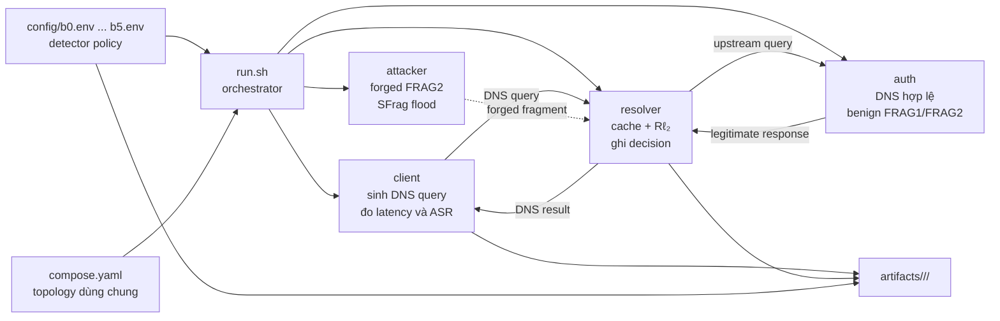

# Báo cáo kiến trúc framework thực nghiệm POPS–Rℓ₂

## 1. Mục tiêu

Framework này phục vụ nhóm thực nghiệm baseline/ablation B0–B5 của cơ chế phát
hiện DNS Cache Poisoning dựa trên Rℓ₂.

Thiết kế cũ tách mỗi thí nghiệm thành một Docker lab riêng. Cách đó làm trùng
lặp `Dockerfile`, topology, địa chỉ mạng, script chạy và mã nguồn detector.
Khi sửa logic chung, tất cả lab phải được cập nhật đồng thời và rất dễ lệch
phiên bản.

Thiết kế mới giữ cố định:

- một topology gồm bốn container;
- một implementation của resolver;
- một script điều phối;
- một định dạng artifact.

B0–B5 chỉ còn là **profile cấu hình detector**. Muốn đổi baseline, ablation,
ngưỡng hoặc workload không cần sao chép thêm Docker lab.

## 2. Phạm vi

Framework trả lời hai câu hỏi độc lập:

1. **Detector nào được bật?** Chọn bằng profile B0–B5.
2. **Loại lưu lượng nào được phát?** Chọn bằng workload
   `baseline`, `benign` hoặc `attack`.

Ví dụ, `b3 benign` nghĩa là chạy detector entropy-only trên fragment hợp lệ;
`b5 attack` nghĩa là chạy detector kết hợp trên SFrag flood.

Framework hiện dùng testbed mô phỏng đã được kiểm chứng trong
`labs/r2entropy`. Nó chưa thay thế E5 bằng Unbound/BIND, IP fragmentation thật
hoặc PCAP replay.

## 3. Kiến trúc tổng thể



Tất cả container nằm trong Docker bridge network `10.70.0.0/24`.

| Thành phần | IP | Trách nhiệm |
| --- | --- | --- |
| `client` | `10.70.0.10` | Tạo cache miss, truy vấn lại `bank.com`, ghi kết quả và latency. |
| `resolver` | `10.70.0.53` | Forward query, cache DNS, quan sát FRAG2, tính feature và áp dụng B0–B5. |
| `auth` | `10.70.0.100` | Trả lời DNS hợp lệ; có thể phát cặp FRAG1/FRAG2 benign cùng IPID. |
| `attacker` | `10.70.0.200` | Phát forged FRAG2/SFrag flood để thử poisoning. |

`attacker` có capability `NET_ADMIN` và `NET_RAW`; chỉ chạy framework trong
môi trường local/isolated.

## 4. Cấu trúc source

```text
research/Report/framework/
├── README.md          # Tài liệu kiến trúc và hướng dẫn này
├── compose.yaml       # Một topology dùng chung
├── run.sh             # Runner chọn profile + workload
├── config/
│   ├── b0.env
│   ├── b1.env
│   ├── b2.env
│   ├── b3.env
│   ├── b4.env
│   └── b5.env
└── artifacts/         # Kết quả sinh khi chạy, đã được Git ignore
```

Framework không nhân bản source của container. `compose.yaml` build lại các
component dùng chung từ:

```text
labs/r2entropy/
├── client/
├── resolver/
├── auth/
└── attacker/
```

Như vậy, sửa thuật toán ở resolver chỉ cần sửa một nơi. Framework chịu trách
nhiệm chọn cấu hình và điều phối thí nghiệm, còn `labs/r2entropy` chứa
implementation của testbed.

## 5. Mô hình detector

Resolver quan sát các FRAG2 có `offset > 0` trong cửa sổ thời gian và tính ba
feature:

| Feature | Ý nghĩa |
| --- | --- |
| `samples` | Tổng số FRAG2 trong cửa sổ. |
| `entropy` | Shannon entropy của phân bố IPID. |
| `unique_ratio` | Số IPID duy nhất chia cho tổng số mẫu. |

Các ngưỡng mặc định:

```text
FRAG2_WINDOW_SECONDS=2.0
R2_MIN_SAMPLES=24
R2_ENTROPY_THRESHOLD=4.0
R2_UNIQUE_RATIO_THRESHOLD=0.70
```

Quyết định của từng profile:

| Profile | `DEFENSE_MODE` | `R2_VARIANT` | Điều kiện block |
| --- | --- | --- | --- |
| B0 — No defense | `off` | `combined` | Không block. |
| B1 — POPS/Rℓ₂ gốc | `on` | `legacy` | Block khi gặp FRAG1, không xét feature. |
| B2 — Volume-only | `on` | `volume` | `samples >= min_samples`. |
| B3 — Entropy-only | `on` | `entropy` | `entropy >= entropy_threshold`. |
| B4 — Unique-only | `on` | `unique` | `unique_ratio >= unique_ratio_threshold`. |
| B5 — Combined | `on` | `combined` | Cả ba điều kiện trên đồng thời đúng. |

Logic B5:

```text
block =
    defense_on
    AND samples >= R2_MIN_SAMPLES
    AND entropy >= R2_ENTROPY_THRESHOLD
    AND unique_ratio >= R2_UNIQUE_RATIO_THRESHOLD
```

B0 giữ `R2_VARIANT=combined` nhưng `DEFENSE_MODE=off`, vì vậy hàm quyết định
luôn trả về `allow`. Điều này giữ cùng code path với B5 và chỉ loại bỏ tác động
của defense.

## 6. Workload

Profile detector và workload được tổ hợp độc lập:

| Workload | Attacker | Benign FRAG2 | Query từ client | Mục đích |
| --- | --- | --- | --- | --- |
| `baseline` | Tắt | Tắt | `safe*` | Đo hệ thống khi không có fragment. |
| `benign` | Tắt | Bật | `frag*` | Đo false positive trên fragment hợp lệ. |
| `attack` | Bật | Tắt | `frag*` | Đo khả năng phát hiện và ngăn poisoning. |

Với workload `benign`, authoritative server phát FRAG1 và FRAG2 có cùng IPID,
không chèn answer độc hại. Với workload `attack`, attacker phát forged FRAG2
trong khi client kích hoạt các query `frag*`.

## 7. Vòng đời một lần chạy

Khi gọi:

```bash
bash run.sh b5 attack 150
```

runner thực hiện:

1. Kiểm tra tên profile và workload.
2. Nạp `config/b5.env`.
3. Build và recreate cùng một stack Docker.
4. Reset benign generator về `off`.
5. Đồng bộ trạng thái defense theo profile.
6. Dừng attacker để tránh state từ lần chạy trước.
7. Chuẩn bị workload:
   - `baseline`: không bật thêm generator;
   - `benign`: bật benign FRAG2 tại auth;
   - `attack`: bật attacker và worker phát forged fragment.
8. Client chạy đủ số `rounds`.
9. Thu result, latency, event, decision, summary và log.
10. Sao chép profile cùng metadata vào artifact của run.

Stack được recreate ở đầu mỗi run để reset cache và state trong container.

## 8. Cách sử dụng

### 8.1. Yêu cầu

- Docker Engine hoặc Docker Desktop;
- Docker Compose v2 (`docker compose`);
- Bash hoặc WSL trên Windows.

### 8.2. Chạy một cấu hình

```bash
cd research/Report/framework

bash run.sh b0 attack 150
bash run.sh b1 benign 150
bash run.sh b5 attack 150
```

Cú pháp:

```text
bash run.sh <b0|b1|b2|b3|b4|b5> \
            <baseline|benign|attack> \
            [rounds]
```

`rounds` mặc định là `150`.

### 8.3. Ma trận B0–B5 tối thiểu

```bash
for profile in b0 b1 b2 b3 b4 b5; do
  bash run.sh "$profile" baseline 150
  bash run.sh "$profile" benign 150
  bash run.sh "$profile" attack 150
done
```

Đây là 18 tổ hợp. Outline nghiên cứu yêu cầu K independent runs cho mỗi cấu
hình; vòng lặp ngoài có thể cấp `RUN_ID` riêng:

```bash
for run in $(seq 1 20); do
  for profile in b0 b1 b2 b3 b4 b5; do
    RUN_ID="run-$(printf '%02d' "$run")" \
      bash run.sh "$profile" attack 150
  done
done
```

Không dùng cùng `RUN_ID/profile/workload` hai lần vì artifact cũ có thể bị ghi
đè.

### 8.4. Override ngưỡng

Biến môi trường của shell có độ ưu tiên cao hơn giá trị trong profile và giá
trị mặc định của Compose:

```bash
R2_MIN_SAMPLES=48 \
R2_ENTROPY_THRESHOLD=5 \
R2_UNIQUE_RATIO_THRESHOLD=0.9 \
FRAG2_WINDOW_SECONDS=2 \
RUN_ID=e3-threshold-48-5-09 \
  bash run.sh b5 attack 300
```

Một số biến thường dùng:

| Biến | Mặc định | Công dụng |
| --- | ---: | --- |
| `ROUNDS` | `150` | Số vòng query nếu không truyền đối số thứ ba. |
| `RUN_ID` | timestamp | Tên run trong thư mục artifact. |
| `IPID_SPACE` | `2048` | Không gian IPID mô phỏng. |
| `ATTACK_RATE` | `0.02` | Tham số tốc độ của attacker. |
| `AUTH_DELAY` | `0.25` | Độ trễ authoritative response. |
| `FRAG2_WINDOW_SECONDS` | `2.0` | Cửa sổ tính feature. |
| `R2_MIN_SAMPLES` | `24` | Ngưỡng volume. |
| `R2_ENTROPY_THRESHOLD` | `4.0` | Ngưỡng entropy. |
| `R2_UNIQUE_RATIO_THRESHOLD` | `0.70` | Ngưỡng tỷ lệ IPID duy nhất. |

## 9. Artifact và cách đọc kết quả

Mỗi lần chạy sinh:

```text
artifacts/<run-id>/<profile>/<workload>/
├── result.txt
├── latency_ms.txt
├── resolver.log
├── profile.env
├── run.meta
└── app/
    ├── frag2_events.jsonl
    ├── r2_decisions.jsonl
    └── r2_summary.json
```

| File | Nội dung |
| --- | --- |
| `result.txt` | IP của `bank.com` sau mỗi vòng; `6.6.6.6` biểu thị poisoned result. |
| `latency_ms.txt` | Latency của trigger query theo từng vòng. |
| `frag2_events.jsonl` | Raw event FRAG2: timestamp, IP nguồn/đích, IPID, offset. |
| `r2_decisions.jsonl` | Feature và quyết định `allow`/`tc_block` tại từng FRAG1. |
| `r2_summary.json` | Tổng số FRAG2, tổng block và decision cuối. |
| `resolver.log` | Log vận hành và nguyên nhân block. |
| `profile.env` | Profile thực nghiệm được chọn. |
| `run.meta` | Profile, workload và số vòng. |

Các trường quan trọng trong một decision:

```json
{
  "r2_variant": "combined",
  "samples": 1250,
  "entropy": 10.17,
  "unique_ratio": 0.99,
  "min_samples": 24,
  "entropy_threshold": 4.0,
  "unique_ratio_threshold": 0.7,
  "action": "tc_block"
}
```

`result.txt` dùng để tính ASR. FPR phải tính từ decision trên workload
`benign`, không suy ra từ ASR vì benign FRAG2 không mang poison answer.

## 10. Thêm thí nghiệm mới

### 10.1. Chỉ thay ngưỡng hoặc tải

Không tạo lab và không sửa source. Truyền biến môi trường khi gọi `run.sh`.

### 10.2. Thêm một detector ablation

Nếu cần B6:

1. Thêm policy mới vào `r2_should_block()` trong
   `labs/r2entropy/resolver/resolver.py`.
2. Bổ sung tên variant vào `VALID_R2_VARIANTS`.
3. Tạo `config/b6.env`.
4. Cho phép `b6` trong validation của `run.sh`.
5. Cập nhật bảng profile và test policy.

Không tạo `compose-b6.yaml`, không copy resolver và không đổi topology.

### 10.3. Thêm workload

Thêm workload vào `case` trong `run.sh` và bật/tắt generator tương ứng. Detector
profile vẫn giữ nguyên, nhờ đó cùng workload có thể chạy trên toàn bộ B0–B5.

## 11. Nguyên tắc tái lập

Để kết quả dùng được cho báo cáo:

- đặt `RUN_ID` duy nhất;
- lưu seed khi generator hỗ trợ seed;
- không thay K sau khi nhìn kết quả;
- reset stack giữa runs;
- giữ tất cả window của cùng run trong cùng train/validation/test partition;
- lưu raw JSONL, profile, command, phiên bản Git và thông tin máy;
- dùng run làm đơn vị độc lập khi tính khoảng tin cậy.

Framework hiện lưu profile và metadata cơ bản. Seed, Git commit, hardware,
CPU/memory và throughput cần được bổ sung trước khi chạy ma trận E1–E4 chính
thức.

## 12. Giới hạn hiện tại

- Fragmentation đang được mô phỏng bằng marker FRAG1/FRAG2 trên `dnslib`, chưa
  phải IP fragment thật.
- Resolver là resolver mô phỏng, chưa phải Unbound/BIND.
- Runner hiện chạy một tổ hợp mỗi lần, chưa randomize thứ tự cấu hình.
- Chưa có scheduler K=20, train/validation/test split hay hierarchical
  bootstrap tích hợp.
- Artifact chưa tự ghi Git commit, seed, CPU, memory và throughput.

Vì vậy, framework phù hợp cho controlled-emulation và baseline/ablation
B0–B5. Không nên dùng kết quả hiện tại để tuyên bố hệ thống đã
production-ready hoặc robust trong môi trường thực tế.

## 13. Tóm tắt quyết định kiến trúc

```text
Một topology
    + một resolver
    + nhiều profile detector
    + nhiều workload độc lập
    + một schema artifact
    = framework B0–B5 không nhân bản Docker lab
```

Điểm mở rộng chính là **config và policy**, không phải Docker topology. Đây là
khác biệt cốt lõi so với kiến trúc “mỗi thí nghiệm là một lab” trước đây.
